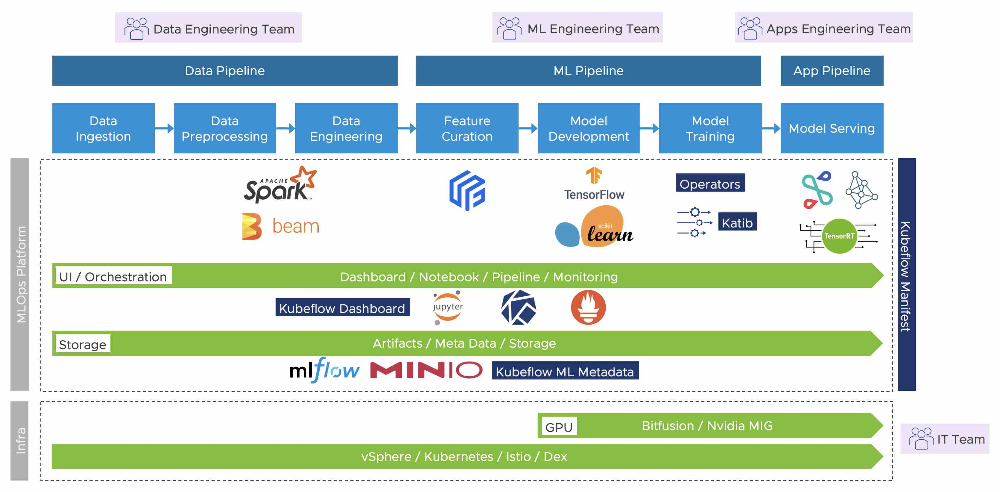

# Kubeflow on vSphere User Guide

## Overview and Architecture

This manual is intended for users that are using Kubeflow on vSphere with Tanzu.
The documentation focuses on specific information on using Kubeflow with vSphere,
including the deployment, resource management, best practices, et al.

We more than welcome contributions to this project. Please report any issue
or feedback related to the documentation in GitHub issues.

## Stack

## Installation
For information about installation, see the [installation guide](./install.md).

## Notebook Service
For information about notebook service, see the [notebook service documentation](./notebook.md).

## Model Serving
For information about model serving part, see the [model serving documentation](./serving.md).

## GPU Support
For information about GPU support, see the [GPU documentation](./gpu.md).

## Storage
For information about storage service, see the [storage documentation](./storage.md).

## Pipeline
For information about pipeline support, see the [pipeline documentation](./pipeline.md).
