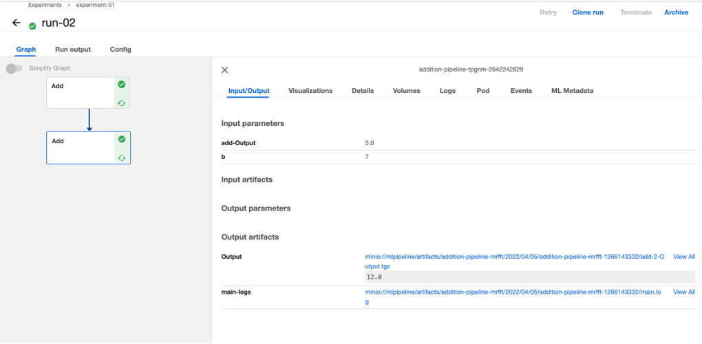

# Pipeline

## Overview

Kubeflow Pipelines is a component of Kubeflow that provides a platform for building and deploying ML workflows.

The Kubeflow Pipelines platform consists of:

* A user interface (UI) for managing and tracking experiments, jobs, and runs.
* An engine for scheduling multi-step ML workflows.
* An SDK for defining and manipulating pipelines and components.
* Notebooks for interacting with the system using the SDK.

The goals of Kubeflow Pipelines:

* End-to-end orchestration: enabling and simplifying the orchestration of machine learning pipelines.
* Easy experimentation: making it easy for you to try numerous ideas and techniques and manage your various trials/experiments.
* Easy re-use: enabling you to re-use components and pipelines to quickly create end-to-end solutions without having to rebuild each time.

## Pipeline Example

1. Install the Kubeflow pipeline SDK

```shell
pip3 install kfp --upgrade
```

2. Create a YAML file to define the component's code as a standalone Python function.

```python
import kfp
from kfp.components import create_component_from_func

def add(a: float, b: float) -> float:
  '''Calculates sum of two arguments'''
  return a + b

add_op = create_component_from_func(
    add, output_component_file='add_component.yaml')

import kfp.dsl as dsl
@dsl.pipeline(
  name='Addition pipeline',
  description='An example pipeline that performs addition calculations.'
)
def add_pipeline(
  a='1',
  b='7',
):
  # Passes a pipeline parameter and a constant value to the `add_op` factory
  # function.
  first_add_task = add_op(a, 4)
  # Passes an output reference from `first_add_task` and a pipeline parameter
  # to the `add_op` factory function. For operations with a single return
  # value, the output reference can be accessed as `task.output` or
  # `task.outputs['output_name']`.
  second_add_task = add_op(first_add_task.output, b)

kfp.compiler.Compiler().compile(
    pipeline_func=add_pipeline,
    package_path='pipeline.yaml')
```

3. Upload the pipeline. Follow the prompts to create an experiment and then create a run. You can find the outputs by clicking each component. The artifacts would be stored in MinIO server or Cloud Storage.


