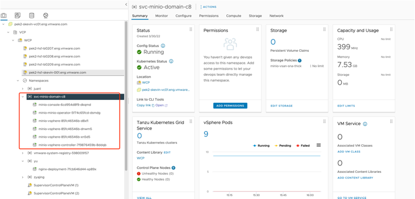
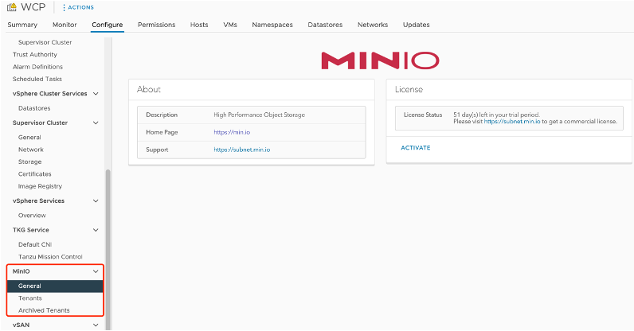
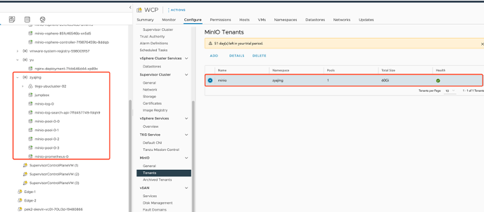

# Storage

MinIO is software-defined high performance object storage and API compatible with Amazon’s S3 cloud storage service.
Use MinIO to build high performance infrastructure for machine learning, analytics and application data workloads.
More details about MinIO could be found on its [website](https://min.io). MinIO has been integrated by vSphere
as supervisor service. In this section, details on how to enable the service and MinIO used for ML workload will
be described.

## Setup MinIO Service in vSphere

### Prerequisites

* Required privilege: Supervisor Services. Manage Supervisor Services
* Make sure that your Supervisor Cluster uses the NSX-T Data Center networking stack
* Download Minio YAML file from [here](https://vmwaresaas.jfrog.io/artifactory/vDPP-Partner-YAML/MinIO/)

### Steps

1. Create the vSAN SNA Storage policy. More details could be found [here](https://docs.vmware.com/en/VMware-vSphere/7.0/vmware-vsphere-with-tanzu/GUID-7CF3C48D-C96E-4E0A-8A59-F54A3F9FC028.html#GUID-7CF3C48D-C96E-4E0A-8A59-F54A3F9FC028).
2. Add a stateful service (MinIO) to vCenter server system. More details could be found [here](https://docs.vmware.com/en/VMware-vSphere/7.0/vmware-vsphere-with-tanzu/GUID-F68B264E-76A3-4A6D-A3B0-17153DDF7A18.html?hWord=N4IghgNiBcIE4FMDmBLAzgFwXABBgFgjgLIoB2AkgPI4AOEArqmTmtgG4oDGCIAvkA)
3. Install stateful service (MinIO) in vSphere with Tanzu. Found details [here](https://docs.vmware.com/en/VMware-vSphere/7.0/vmware-vsphere-with-tanzu/GUID-F68B264E-76A3-4A6D-A3B0-17153DDF7A18.html?hWord=N4IghgNiBcIE4FMDmBLAzgFwXABBgFgjgLIoB2AkgPI4AOEArqmTmtgG4oDGCIAvkA).
4. Check MinIO service namespace to verify all appropriate resources for the service have been created. As shown in the following figures.





## Deploy MinIO tenant

### Prerequisites

The vSAN SNA storage policy should be created bofore the setup. To check the storage
policy, select namespace, click "EDIT STORAGE", and check the vSAN SNA storage policy.

### Steps

Refer to [this page](https://docs.min.io/minio/vsphere/tutorials/deploy-minio-tenant.html) for more information on how to deploy MinIO tenant.

### Verfication

After all done, the tenant view shows the current status as the following figure.



## MinIO Basic Usage

### Access MinIO UI

Navigate to MinIO tenant details. "Console Endpoint: https://<IP address>:9443" is shown.
Access console endpoint, using username and password are set when MinIO tenant is created.

### Access MinIO storage with MinIO client (mc)

This part will introduce how to access MinIO storage with MinIO command client. For
more details, refer to [this](https://docs.min.io/docs/minio-client-complete-guide.html).

1. Download and install MinIO client
2. Add MinIO service with the following commands

   ```shell
   # add MinIO alias
   mc alias --insecure set <ALIAS> <YOUR-S3-ENDPOINT> [YOUR-ACCESS-KEY] [YOUR-SECRET-KEY]
   
   # list all buckets
   mc ls <ALIAS>
   
   # list all files
   mc ls <ALIAS>/<BUCKET>
   ```

3. Create bucket

   ```shell
   mc mb minio-zyajing/datasets --insecure
   ```

4. Upload ML dataset to bucket

   ```shell
   # Example: upload mnist dataset to bucket
   mc cp train-images-idx3-ubyte minio-zyajing/datasets/ --insecure
   ```

## Example: training with MinIO storage service

### Prerequisites

* Python 3.6+
* Update MinIO parameters to guarantee your access to MinIO service
* Create "datasets" bucket and upload 4 mnist datasets to the bucket

### Run sample code

```shell
wget https://github.com/AmyHoney/mlopsSync/blob/main/storage-minio/tensorflow-minio-example/minio_keras_mnist.py
python minio_keras_mnist.py
```
