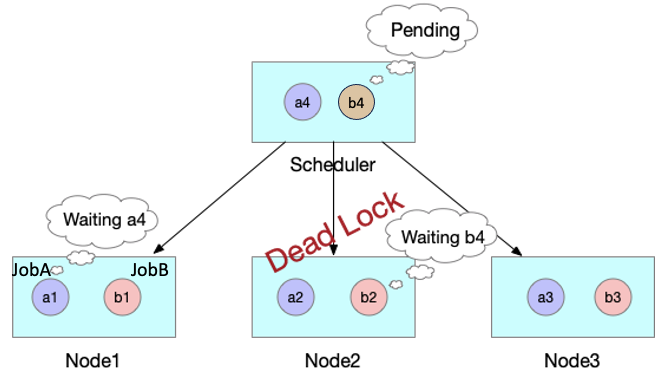

===============
Gang Scheduling
===============

------------
Introduction
------------

Kubernetes is widely used for online service orchestration. In order to improve cluster utilization and operational efficiency, we aim to 
use Kubernetes as a unified management platform for both online services and offline jobs. The default scheduler schedules Pods sequentially 
without considering the relationship between them. However, many offline jobs involving data computation require co-scheduling. 
Co-scheduling means that all tasks must be created before running properly the entire job. If some tasks have been started while others 
have not, the started tasks will wait for the scheduler to schedule the remaining tasks. This scenario is known as gang scheduling.

As shown in the diagram below, JobA can only run properly if all four Pods are started simultaneously. The Kube-scheduler schedules and 
creates the first three Pods sequentially. However, the cluster resources are not sufficient for the Kube-scheduler to schedule the 
fourth Pod. As a result, the first three Pods of JobA remain in a pending state, continuing to occupy resources. If the fourth Pod 
cannot be started in a timely manner, the entire JobA cannot run, and it may even lead to wasted cluster resources.

Even worse, as shown in the diagram below, all other cluster resources are occupied by the first three pods of JobB, and Kube-scheduler is 
also waiting to create the fourth pod for JobB. This situation can lead to a deadlock, causing the entire cluster to be unable to function.

Gang scheduling allows no fragments, which means "all or nothing", which can help to reduce resource waste, and improve the overall resource 
utilization of clusters. This guide describes how to use `Scheduler Plugins <https://github.com/kubernetes-sigs/scheduler-plugins/tree/release-1.23>`_ 
and `Volcano Scheduler <https://github.com/volcano-sh/volcano>`_ with coscheduling to support gang-scheduling in Kubeflow, 
to allow jobs to run multiple pods at the same time.

-----------------------
Try Out Gang-scheduling
-----------------------

^^^^^^^^^^^^^
Prerequisites
^^^^^^^^^^^^^

* A client host with the following commands installed: ``kubectl`` and ``helm``.
* A TKG cluster running on vSphere, with the package repository installed.
* Kubeflow v1.6.0 and later on vSphere.

^^^^^^^^^^^^^^^^^^^^^^^^^^^^^^^^^^^^
Scheduler plugins with co-scheduling
^^^^^^^^^^^^^^^^^^^^^^^^^^^^^^^^^^^^
Scheduler plugins scheduler is integrated by Kubeflow Training Operator v1.5.0, and the corresponding 
Kubeflow version is 1.6.0. The minor version of the scheduler-plugins matches the minor version of the 
k8s client packages that it is compiled with. For example we use the k8s v1.23.x dependencies, there are 
built with scheduler-plugins v0.23.x releases. By default, we install the scheduler-plugins as a second 
scheduler. You can use the `scheduler-plugins-v0.23 <https://github.com/vmware/vSphere-machine-learning-extension/blob/gang-scheduling/docs/_static/scheduler-plugins-v0.23.yaml>`_ deployment yaml file to deploy scheduler-plugins.
If you want to install other versions or install that as a single scheduler, you can refer to `this doc <https://github.com/kubernetes-sigs/scheduler-plugins/blob/release-1.23/doc/install.md>`_.

.. code-block:: shell

    $ kubectl apply -f scheduler-plugins-v0.23.yaml

    $ kubectl get pods -n scheduler-plugins

    NAME                                           READY   STATUS    RESTARTS   AGE
    scheduler-plugins-controller-f5cdf9674-6jl5r   1/1     Running   0          46s
    scheduler-plugins-scheduler-76d448cc88-tldp8   1/1     Running   0          31s

If we install Scheduler Plugins in the cluster as a secondary scheduler, we need to onfigure the training operator
deployment to select the scheduler name for gang-scheduling in the following,

.. code-block:: shell

    ...
    spec:
      containers:
        - command:
            - /manager
    +       - --gang-scheduler-name=scheduler-plugins
          image: kubeflow/training-operator
          name: training-operator
    ...

In this example, a distributed TensorFlow job is used to demonstrate how to enable gang scheduling.

.. code-block:: shell

    apiVersion: "kubeflow.org/v1"
    kind: "TFJob"
    metadata:
      name: tfjob-gpu-gang-scheduling
    spec:
      tfReplicaSpecs:
        Worker:
          replicas: 3
          template:
            spec:
              schedulerName: scheduler-plugins-scheduler
              containers:
                - args:
                    - python
                    - tf_cnn_benchmarks.py
                    - --batch_size=32
                    - --model=resnet50
                    - --variable_update=parameter_server
                    - --flush_stdout=true
                    - --num_gpus=1
                    - --local_parameter_device=cpu
                    - --device=gpu
                    - --data_format=NHWC
                  image: kubeflow/tf-benchmarks-gpu:v20171202-bdab599-dirty-284af3
                  name: tensorflow
                  resources:
                    limits:
                    nvidia.com/gpu: 1
                  workingDir: /opt/tf-benchmarks/scripts/tf_cnn_benchmarks
              restartPolicy: OnFailure
        PS:
          replicas: 1
          template:
            spec:
            containers:
              - args:
                  - python
                  - tf_cnn_benchmarks.py
                  - --batch_size=32
                  - --model=resnet50
                  - --variable_update=parameter_server
                  - --flush_stdout=true
                  - --num_gpus=1
                  - --local_parameter_device=cpu
                  - --device=cpu
                  - --data_format=NHWC
                image: kubeflow/tf-benchmarks-cpu:v20171202-bdab599-dirty-284af3
                name: tensorflow
                resources:
                  limits:
                  cpu: "1"
                workingDir: /opt/tf-benchmarks/scripts/tf_cnn_benchmarks
            restartPolicy: OnFailure

Scheduler Plugins and traning operator in Kubeflow achieve gang-scheduling by using PodGroup. 
The Training Operator will create the PodGroup of the job automatically.

.. code-block:: shell

    $ kubectl get podgroup -n user 

    NAME                            AGE
    tfjob-gpu-gang-scheduling       11m

When the computing resources in the cluster are insufficient to schedule the minimum number of pods, 
the pod group cannot be scheduled and all pods are in the Pending state.

.. code-block:: shell

    $ kubectl get po -n user

    NAME                                               READY   STATUS    RESTARTS   AGE
    tfjob-gpu-gang-scheduling-ps-0                     0/2     Pending   0          41m
    tfjob-gpu-gang-scheduling-worker-0                 0/2     Pending   0          41m
    tfjob-gpu-gang-scheduling-worker-1                 0/2     Pending   0          41m
    tfjob-gpu-gang-scheduling-worker-2                 0/2     Pending   0          41m

    $ kubectl logs training-operator-xxx -n kubeflow
    # DEBUG	events	Error pod tfjob-gpu-gang-scheduling-worker-0 condition message: 0/4 nodes are available: 1 node(s) had taint {node-role.kubernetes.io/master: }, that the pod didn't tolerate, 3 Insufficient nvidia.com/gpu.	{"type": "Warning", "object": {"kind":"TFJob","namespace":"user","name":"tfjob-gpu-gang-scheduling","uid":"ca31f1bd-89ac-4263-9c9b-a620a11992f4","apiVersion":"kubeflow.org/v1","resourceVersion":"74777688"}, "reason": "Unschedulable"}

^^^^^^^^^^^^^^^^^^^^^^^^^^^^^^^^^^^^
Volcano Scheduler with co-scheduling
^^^^^^^^^^^^^^^^^^^^^^^^^^^^^^^^^^^^

You can also install volcano scheduler in your cluster first as a secondary scheduler of Kubernetes and 
configure the training operator to select the scheduler name for gang-scheduling as below:

.. code-block:: shell

    $ k get pods -n volcano-system

    NAME                                   READY   STATUS      RESTARTS   AGE
    volcano-admission-76bd985b56-jtfvv     1/1     Running     0          10d
    volcano-admission-init-zwqgg           0/1     Completed   0          10d
    volcano-controllers-7655bb499f-xsmsw   1/1     Running     0          10d
    volcano-scheduler-6bf4759c45-ss67q     1/1     Running     0          10d

.. code-block:: shell

    ...
    spec:
      containers:
        - command:
            - /manager
    +       - --gang-scheduler-name=volcano
          image: kubeflow/training-operator
          name: training-operator
    ...