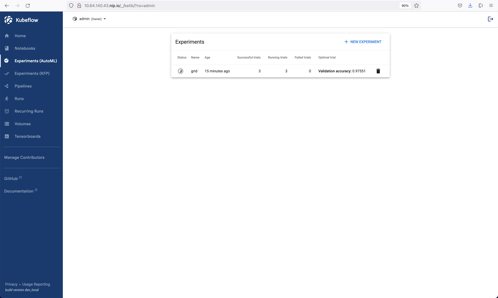
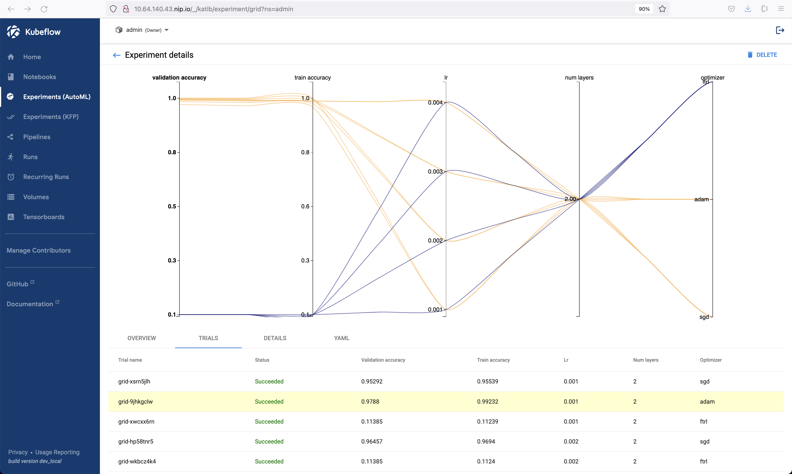

=====================
Hyperparameter Tuning
=====================

------------
Introduction
------------

We use *Katib* for hyperparameter tuning. Katib is a Kubernetes-native project for automated machine learning (AutoML). 
It supports hyperparameter tuning, early stopping and neural architecture search (NAS). It tunes hyperparameters of applications 
written in any language of the your choice and natively supports many machine learning (ML) frameworks, such as TensorFlow, MXNet, PyTorch, XGBoost, 
and etc. In this section, you use Katib to automate the tuning of ML hyperparameters which control the AI 
learning way and rate. Katib is also used to offer neural architecture search features in order to help you find your model's 
optimal architecture. If you are unfamiliar with hyperparameters tuning or Katib, please refer to 
`Introduction to Katib <https://www.kubeflow.org/docs/components/katib/overview/>`_ for more information.

You use Katib to get the most effective configuration for the current task by running multiple experiments, each representing
a single tuning operation. An experiment consists of an objective specifying what to be optimized, a search space representing
the constraints used for the optimization, and an algorithm used to find the optimal values.

In this section, there are two ways to run Katib experiments.

-----------
Get Started
-----------

^^^^^^^^^^^^^^^^^^^^^^^^^^^^^^
Run Katib experiments from CLI
^^^^^^^^^^^^^^^^^^^^^^^^^^^^^^

You can run Katib experiments through Freestone Kubeflow UI.

First download an example to create a Katib experiment:

.. code-block:: shell

    curl https://raw.githubusercontent.com/kubeflow/katib/master/examples/v1beta1/hp-tuning/grid.yaml > grid-example.yaml

.. Note:: 
    if you use a different namespace from ``kubeflow``, make sure to change it in the downloaded file ``grid-example.yaml``.

As Istio sidecar is incompatible with Katib experiments, disable it using ``yq``. To install ``yq``, please refer to its 
`installation document <https://github.com/mikefarah/yq/#install>`_.

.. code-block:: shell

    yq -i '.spec.trialTemplate.trialSpec.spec.template.metadata.annotations."sidecar.istio.io/inject" = "false"' grid-example.yaml

Now you are ready to apply the YAML file to start your experiment:

.. code-block:: shell

    kubectl apply -f grid-example.yaml

Katib experiment then starts running. You can inspect experiment progress using ``kubectl`` by running the following command:

.. code-block:: shell

    kubectl -n kubeflow get experiment grid-example -o yaml

^^^^^^^^^^^^^^^^^^^^^^^^^^^^^^^^^^^^^^^^^^^^^^^^^^^^^^^^^
Run Katib experiments from Freestone Kubeflow UI
^^^^^^^^^^^^^^^^^^^^^^^^^^^^^^^^^^^^^^^^^^^^^^^^^^^^^^^^^

You can also use Freestone Kubeflow UI to run Katib experiments. 

Again, first save the following content as ``grid-example.yaml`` which is used to generate Katib experiment.

.. code-block:: yaml

    ---
    apiVersion: kubeflow.org/v1beta1
    kind: Experiment
    metadata:
      namespace: <YOUR_NAME_SPACE>
      name: grid
    spec:
      objective:
        type: maximize
        goal: 0.99
        objectiveMetricName: Validation-accuracy
        additionalMetricNames:
          - Train-accuracy
      algorithm:
        algorithmName: grid
      parallelTrialCount: 3
      maxTrialCount: 12
      maxFailedTrialCount: 3
      parameters:
        - name: lr
          parameterType: double
          feasibleSpace:
            min: "0.001"
            max: "0.01"
            step: "0.001"
        - name: num-layers
          parameterType: int
          feasibleSpace:
            min: "2"
            max: "5"
        - name: optimizer
          parameterType: categorical
          feasibleSpace:
            list:
              - sgd
              - adam
              - ftrl
      trialTemplate:
        primaryContainerName: training-container
        trialParameters:
          - name: learningRate
            description: Learning rate for the training model
            reference: lr
          - name: numberLayers
            description: Number of training model layers
            reference: num-layers
          - name: optimizer
            description: Training model optimizer (sdg, adam or ftrl)
            reference: optimizer
        trialSpec:
          apiVersion: batch/v1
          kind: Job
          spec:
            template:
              metadata:
                annotations:
                  sidecar.istio.io/inject: "false"
              spec:
                containers:
                  - name: training-container
                    image: docker.io/kubeflowkatib/mxnet-mnist:latest
                    command:
                      - "python3"
                      - "/opt/mxnet-mnist/mnist.py"
                      - "--batch-size=64"
                      - "--lr=${trialParameters.learningRate}"
                      - "--num-layers=${trialParameters.numberLayers}"
                      - "--optimizer=${trialParameters.optimizer}"
                restartPolicy: Never

Open the ``grid-example.yaml`` file and edit it, changing ``.metadata.namespace`` to your own. Note that here we also disable Istio 
sidecar using ``sidecar.istio.io/inject: "false"``, under ``.spec.trialTemplate.trialSpec.spec.template.metadata.annotations``.

Open Freestone Kubeflow UI in your browswer, go to **Experiments (AutoML)** on the left panel, and select **New Experiment**.

.. image:: ../_static/user-guide-katib-experiment.png

Click the link labelled **Edit and submit YAML** at the bottom, and paste the content of the file ``grid-example.yaml`` you just saved and edited. 
Then click **CREATE**.

.. image:: ../_static/user-guide-katib-createExperiment.png

Once the experiment is created and submitted, in the Katib dashboard under **Experiment (AutoML)**, you see the experiment
starts running. To inspect the experiment for more details, click on the experiment.

.. image:: ../_static/user-guide-katib-dashboard.png

In the Experiment Details view, you can see how your experiment is progressing, such as information of each running trial, the 
experiment's YAML file, and a plot recording parameters and metrics related to your experiment.

.. image:: ../_static/user-guide-katib-details.png

The experiment keeps running until the objective you set in the YAML file gets realized, or it's timed out. In this example, when
the experiment finishes, you see the recommended hyperparameters information, as well as the results of all trial
and the optimal metrics.

.. image:: ../_static/user-guide-katib-dashboardSuccess.png

.. note:: 
    The experiment takes some time to finish, from about 30 minutes to 2 hours.

