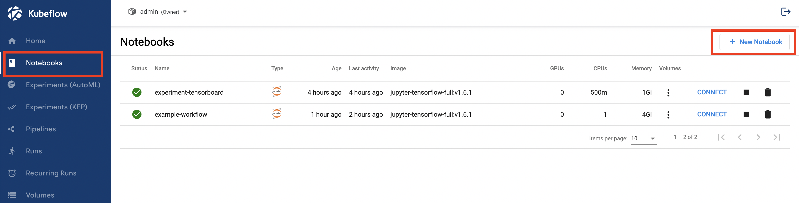
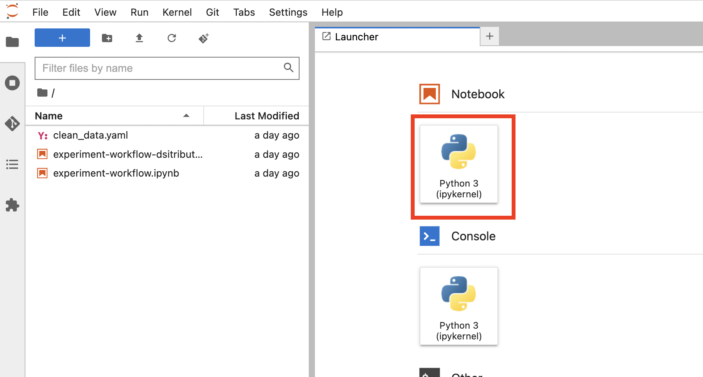
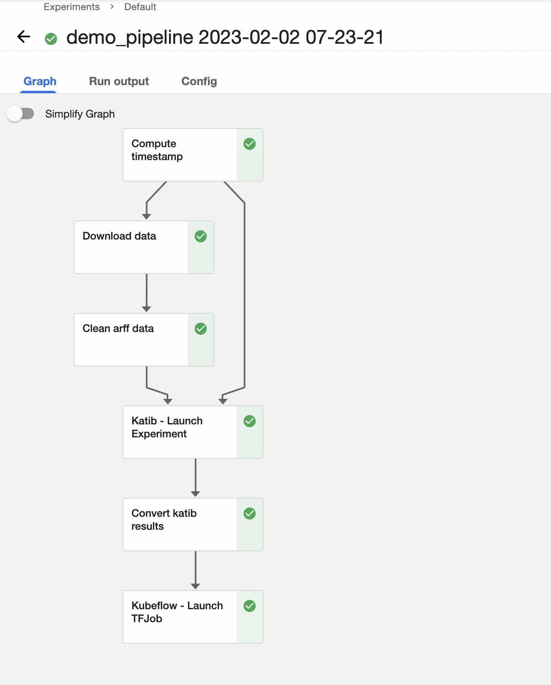
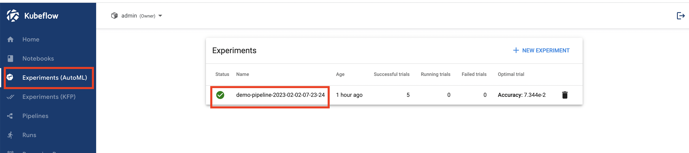
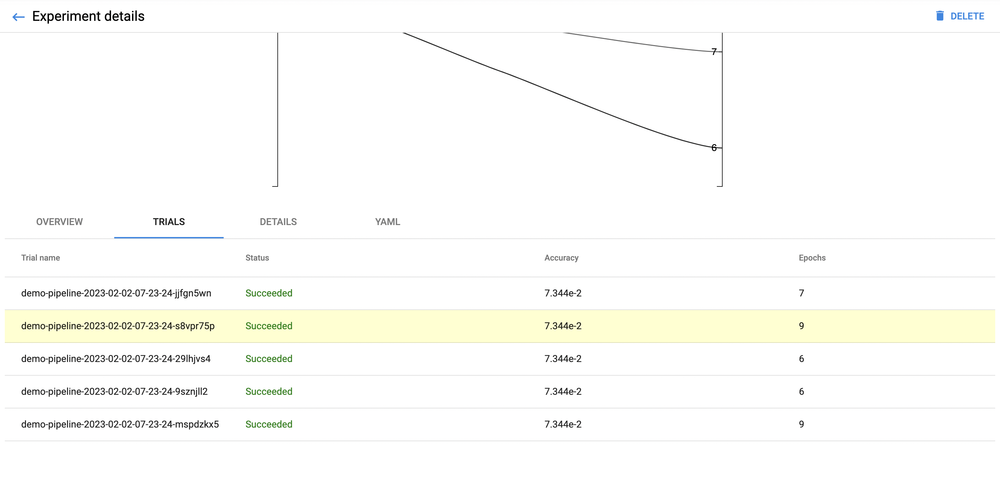

========================================
Kubeflow Pipelines with MLFlow and Katib
========================================

------------
Introduction
------------

This section intends to introduce you complete machine learning (ML) workflow using Freestone Kubeflow. In particular, examples of Kubeflow Pipelines using Katib hyperparameter tuning and MLFlow model registry are presented along with some common pipeline steps and interfaces such as S3.

For more detailed documentation on Kubeflow Pipelines, refer to `Kubeflow Pipelines | Kubeflow <https://www.kubeflow.org/docs/components/pipelines/>`__.

For more detailed documentation on Kubeflow Katib, refer to `Katib | Kubeflow <https://www.kubeflow.org/docs/components/katib/>`__.

The following diagram outlines ML workflow presented in this section. Major pipeline steps include:

* Ingest dataset.
* Clean up the dataset.
* Store cleaned data to S3 bucket.
* Hyperparameter-tune using Katib and TensorFlow training container image (with MLFlow store functionality).
* Convert Katib tuning results to streamlined format.
* Train model using best parameters from tuning stage.
* Store the production model to MLFlow model registry.

.. image:: ../_static/user-guide-kfp-mlflow-katib-overview.png

-------------
Prerequisites
-------------

* Deployed MLFlow. For deployment of MLFlow, refer to :ref:`user-guide-mlflow`.
* Familiarity with `Python <https://docs.python.org/3/tutorial/>`__, `Docker <https://docs.docker.com/>`__, `Jupyter Notebook <https://jupyter-notebook.readthedocs.io/en/stable/>`__.

-----------
Get started
-----------

^^^^^^^^^^^^^^^^^^^^^^^^^^^^^^^^^^^^^^^^^^^
Create Notebook Server and Jupyter Notebook
^^^^^^^^^^^^^^^^^^^^^^^^^^^^^^^^^^^^^^^^^^^

Access Freestone Kubeflow Dashboard, and navigate to **Notebooks**. Fill in a name. Select TensorFlow image ``jupyter-tensorflow-full:v1.6.1``. 
And select minimum configuration: 1 CPU and 4GB of RAM. Also, remember to enable ``mlflow-server-minio`` option in the configuration section.

    
.. image:: ../_static/user-guide-kfp-mlflow-katib-createNotebook1.png

.. image:: ../_static/user-guide-kfp-mlflow-katib-createNotebook2.png

Connect to the newly created notebook. And create a Jupyter notebook to hold codes that specify the Kubeflow pipeline.

^^^^^^^^^^^^^^^^^^^^^
Define pipeline steps
^^^^^^^^^^^^^^^^^^^^^

"""""""""""""""""
Setup environment
"""""""""""""""""

To setup environment, add the following cells to the newly created Jupyter notebook:

.. code-block:: text

    !pip install kfp==1.8.12
    !pip install kubeflow-katib==0.13.0

    import json
    import kfp
    from kfp import dsl
    from kfp import Client
    from kfp import components
    from kfp.onprem import use_k8s_secret
    import numpy as np
    import pandas as pd
    from scipy.io.arff import loadarff
    from kubeflow.katib import ApiClient
    from kubeflow.katib import V1beta1ExperimentSpec
    from kubeflow.katib import V1beta1AlgorithmSpec
    from kubeflow.katib import V1beta1ObjectiveSpec
    from kubeflow.katib import V1beta1ParameterSpec
    from kubeflow.katib import V1beta1FeasibleSpace
    from kubeflow.katib import V1beta1TrialTemplate
    from kubeflow.katib import V1beta1TrialParameterSpec

"""""""""""""""""""""""""""""""""""""""
Create data ingestion and cleanup steps
"""""""""""""""""""""""""""""""""""""""

Create pipeline steps that do data ingestion and cleanup. Setup transfer of clean data to the next step using S3 bucket.

.. note::
    Ingesting and cleaning of input data in this section is an example of how data can be processed in the pipeline. Different data 
    ingestion, data cleaning, data formats can be integrated.

To load raw data into the pipeline, use Kubeflow Pipelines component `reusable web downloader component <https://github.com/kubeflow/pipelines/blob/master/components/contrib/web/Download/component.yaml>`__ to create data ingest operation.

.. code-block:: python

    # Data ingest operation.
    # Output is in outputs['data']
    ingest_data_op = components.load_component_from_url(
    'https://raw.githubusercontent.com/kubeflow/pipelines/master/components/contrib/web/Download/component.yaml'
    )

The data in this example is in ARFF format. Create function that do cleanup of ingested data. In this example, this function 
relies on specific components to aid in data processing. They are specified as packages and imported in the function code and 
cleanup data operation. Note that S3 bucket is used to save output for cleaned data.

.. important::
    In following codes, environment variables ``AWS_ACCESS_KEY_ID`` and ``AWS_SECRET_ACCESS_KEY`` are used. Make sure you set them up.

.. note::
    To get your ``AWS_ACCESS_KEY_ID`` and ``AWS_SECRET_ACCESS_KEY``, or to get more detailed instructions on S3 and MinIO, refer to
    :ref:`user-guide-mlflow`.

.. code-block:: python

    # Data clean up operation.
    # Output is in S3 (specified by `bucket`)
    def clean_arff_data(
        bucket,
        key,
        input_file: components.InputPath(str)
    ) -> str:
        import pandas as pd
        import boto3
        import os
        from io import StringIO
        from scipy.io.arff import loadarff

        print(f"Loading input file {input_file}")

        # Convert to dataframe arff format.
        raw_data = loadarff(input_file)
        df_data = pd.DataFrame(raw_data[0].copy())
        print(f"Loaded data file of shape {df_data.shape}")

        print(f"Cleaning the data")
        # Convert target column to numeric.
        df_data.iloc[:, -1] = pd.get_dummies(df_data['CHURN']).iloc[:, 0]

        # Remove missing values.
        df_clean = df_data.dropna(axis=1)
        df_clean.loc[:,'CHURN'] = pd.get_dummies(df_data['CHURN']).iloc[:, 0]

        # Get rid of non-numeric columns.
        df_clean = df_clean.select_dtypes(exclude='object')

        print("Saving results to S3")
        csv_buffer = StringIO()
        df_clean.to_csv(csv_buffer)
        s3_resource = boto3.resource(
            's3',
            endpoint_url='http://minio.kubeflow.svc.cluster.local:9000',
            aws_access_key_id=os.getenv('AWS_ACCESS_KEY_ID'),
            aws_secret_access_key=os.getenv('AWS_SECRET_ACCESS_KEY')
        )
        check_bucket = s3_resource.Bucket(bucket)
        if not check_bucket.creation_date:
            # bucket does not exist, create it
            s3_resource.create_bucket(Bucket=bucket)
        print(f"Saving CSV of shape {df_clean.shape} to s3")
        s3_resource.Object(bucket, key).put(Body=csv_buffer.getvalue())

        return "Done"

Define data cleanup operation based on data clean up function.

.. code-block:: python

    # Data cleanup operation.
    # Output data is in S3.
    clean_data_op = components.create_component_from_func(
            clean_arff_data,
            "clean_data.yaml",
            packages_to_install=["pandas==1.2.4", "scipy==1.7.0", "boto3"],
    )

"""""""""""""""""""""""""""""""""
Create hyperparameter-tuning step
"""""""""""""""""""""""""""""""""

Create the next pipeline step that does hyperparameter tuning using Katib and a training container image 
``docker.io/misohu/kubeflow-training:latest``.

Note that output of Katib hyperparameter tuning is converted into ``string`` format by helper function ``convert_katib_results()``.

Define Katib hyperparameter tuninig operation.

.. code-block:: python

    # Katib hyperparameter tuning operation.
    def create_katib_experiment_op(experiment_name, experiment_namespace, bucket, key):
        import os
        
        os.environ["AWS_ACCESS_KEY_ID"] = '<your_minio_access_key>'
        os.environ["AWS_SECRET_ACCESS_KEY"] = '<your_minio_secret_key>'
        
        # Trial count specification.
        max_trial_count = 5
        max_failed_trial_count = 3
        parallel_trial_count = 2

        # Objective specification.
        objective = V1beta1ObjectiveSpec(
            type="maximize",
            goal=0.95,
            objective_metric_name="accuracy"
        )

        # Algorithm specification.
        algorithm = V1beta1AlgorithmSpec(
            algorithm_name="random",
        )

        # Experiment search space.
        # In this example we tune the number of epochs.
        parameters = [
            V1beta1ParameterSpec(
                name="epochs",
                parameter_type="int",
                feasible_space=V1beta1FeasibleSpace(
                    min="5",
                    max="10"
                ),
            )
        ]

        # Experiment trial template.
        trial_spec = {
            "apiVersion": "batch/v1",
            "kind": "Job",
            "spec": {
                "template": {
                    "metadata": {
                        "annotations": {
                            "sidecar.istio.io/inject": "false"
                        }
                    },
                    "spec": {
                        "containers": [
                            {
                                "name": "tensorflow",
                                "image": "docker.io/misohu/kubeflow-training:latest",
                                "command": [
                                    "python",
                                    "/opt/model.py",
                                    f"--s3-storage=true",
                                    "--epochs=${trialParameters.epochs}",
                                    f"--bucket={bucket}",
                                    f"--bucket-key={key}",
                                ],
                                "envFrom": [
                                    {
                                        "secretRef": {
                                            "name": "mlpipeline-minio-artifact"
                                        }
                                    }
                                ]
                            }
                        ],
                        "restartPolicy": "Never"
                    }
                }
            }
        }

        # Configure parameters for the Trial template.
        trial_template = V1beta1TrialTemplate(
            primary_container_name="tensorflow",
            trial_parameters=[
                V1beta1TrialParameterSpec(
                    name="epochs",
                    description="Learning rate for the training model",
                    reference="epochs"
                )
            ],
            trial_spec=trial_spec
        )

        # Create an Experiment from the above parameters.
        experiment_spec = V1beta1ExperimentSpec(
            max_trial_count=max_trial_count,
            max_failed_trial_count=max_failed_trial_count,
            parallel_trial_count=parallel_trial_count,
            objective=objective,
            algorithm=algorithm,
            parameters=parameters,
            trial_template=trial_template
        )

        # Create the KFP operation for the Katib experiment.
        # Experiment spec should be serialized to a valid Kubernetes object.
        katib_experiment_launcher_op = components.load_component_from_url(
            "https://raw.githubusercontent.com/kubeflow/pipelines/master/components/kubeflow/katib-launcher/component.yaml")
        op = katib_experiment_launcher_op(
            experiment_name=experiment_name,
            experiment_namespace=experiment_namespace,
            experiment_spec=ApiClient().sanitize_for_serialization(experiment_spec),
            experiment_timeout_minutes=60,
            delete_finished_experiment=False)

        return op

Define Katib convert results operation.

.. code-block:: python

    # Convert Katib experiment hyperparameter results to arguments in string format.
    def convert_katib_results(katib_results) -> str:
        import json
        import pprint
        katib_results_json = json.loads(katib_results)
        print("Katib hyperparameter tuning results:")
        pprint.pprint(katib_results_json)
        best_hps = []
        for pa in katib_results_json["currentOptimalTrial"]["parameterAssignments"]:
            if pa["name"] == "epochs":
                best_hps.append("--epochs=" + pa["value"])
        print("Best hyperparameters: {}".format(best_hps))
        return " ".join(best_hps)

.. code-block:: python

    # Katib convert results operation.
    convert_katib_results_op = components.func_to_container_op(convert_katib_results)

""""""""""""""""""""""""""
Create model training step
""""""""""""""""""""""""""

Create the last step of the pipeline that does model training using TensorFlow based on Katib tuning results.

.. code-block:: python

    # Tensorflow job operation.
    def create_tfjob_op(tfjob_name, tfjob_namespace, model, bucket, key):
        tf_model = str(model)

        tfjob_chief_spec = {
            "replicas": 1,
            "restartPolicy": "OnFailure",
            "template": {
                "metadata": {
                    "annotations": {
                        "sidecar.istio.io/inject": "false"
                    }
                },
                "spec": {
                    "containers": [
                        {
                            "name": "tensorflow",
                            "image": "docker.io/misohu/kubeflow-training:latest",
                            "command": [
                                "python",
                                "/opt/model.py",
                                "--s3-storage=true",
                                f"{tf_model}",
                                "--mlflow-model-name=ml-workflow-demo-model",
                                f"--bucket={bucket}",
                                f"--bucket-key={key}",
                            ],
                            "envFrom": [
                            {
                                "secretRef": {
                                "name": "mlpipeline-minio-artifact"
                                }
                            }
                            ]
                        }
                    ]
                }
            }
        }
        tfjob_worker_spec = {
            "replicas": 1,
            "restartPolicy": "OnFailure",
            "template": {
                "metadata": {
                    "annotations": {
                        "sidecar.istio.io/inject": "false"
                    }
                },
                "spec": {
                    "containers": [
                        {
                            "name": "tensorflow",
                            "image": "docker.io/misohu/kubeflow-training:latest",
                            "command": [
                                "python",
                                "/opt/model.py",
                                "--s3-storage=true",
                                f"{tf_model}",
                                f"--bucket={bucket}",
                                f"--bucket-key={key}",
                            ],
                            "envFrom": [
                            {
                                "secretRef": {
                                "name": "mlpipeline-minio-artifact"
                                }
                            }
                            ]
                        }
                    ]
                }
            }
        }
        
        # Create the KFP task for the TFJob.
        tfjob_launcher_op = components.load_component_from_url(
    "https://raw.githubusercontent.com/kubeflow/pipelines/master/components/kubeflow/launcher/component.yaml")
        op = tfjob_launcher_op(
            name=tfjob_name,
            namespace=tfjob_namespace,
            chief_spec=json.dumps(tfjob_chief_spec),
            worker_spec=json.dumps(tfjob_worker_spec),
            tfjob_timeout_minutes=60,
            delete_finished_tfjob=False)
        return op

""""""""""""""""""""""""""""
Create timestamp helper step
""""""""""""""""""""""""""""

Define a helper that generates timestamps in a Kubeflow Pipeline step. It is needed to generate unique names for some of pipeline steps.

.. code-block:: python

    def compute_timestamp() -> str:
        import datetime
        return datetime.datetime.now().strftime("%Y-%m-%d-%H-%M-%S")

    compute_timestamp_op = components.func_to_container_op(compute_timestamp)

^^^^^^^^^^^^^^^
Create pipeline
^^^^^^^^^^^^^^^

Define and create the complete pipeline that consists of all steps created earlier. Note that the name of the pipeline must be unique. If there 
is previously defined pipeline with the same name and in the same namespace, either change the name of current pipeline or 
delete the older pipeline from the namespace.

.. code-block:: python

    demo_pipeline_name = "demo-pipeline"
    namespace = "admin"
    s3_bucket = "demo-dataset"
    key = "data.csv"
    dataset_url = "https://api.openml.org./data/download/53995/KDDCup09_churn.arff"

    @dsl.pipeline(
        name = "ML Workflow in Kubeflow",
        description = "Demo pipeline"
    )
    def demo_pipeline(name=demo_pipeline_name, namepace=namespace):

        # Generate timestamp for unique pipeline name.
        timestamp_task = compute_timestamp_op()

        # Step 1: Download dataset.
        ingest_data_task = ingest_data_op(url=dataset_url)

        # Ensure timestamp generation for pipeline name is completed and set pipeline name.
        ingest_data_task.after(timestamp_task)
        pipeline_name = f"{name}-{timestamp_task.output}"

        # Step 2: Clean up the dataset and store it in S3 bucket.
        # Note that we pass the `ingest_data_task.outputs['data']` as an argument here.  Because that output is
        # defined as a file path, Kubeflow Pipeline will copy the data from ingest_data_task to clean_data_task.
        clean_data_task = clean_data_op(
            s3_bucket,
            key,
            ingest_data_task.outputs['data']
        )

        # Because S3 access needs credentials, an extra directive is needed to pull those from an existing secret.
        clean_data_task.apply(use_k8s_secret(
            secret_name='mlpipeline-minio-artifact',
            k8s_secret_key_to_env={
                'accesskey': 'AWS_ACCESS_KEY_ID',
                'secretkey': 'AWS_SECRET_ACCESS_KEY',
            }
        ))

        # Wait for clean up data task to finish.
        with dsl.Condition(clean_data_task.output == "Done"):
            # Step 3: Run hyperparameter tuning with Katib.
            katib_task = create_katib_experiment_op(
                experiment_name=pipeline_name,
                experiment_namespace=namespace,
                bucket=s3_bucket,
                key=key
            )

            # Step 4: Convert Katib results produced by hyperparameter tuning to model.
            best_katib_model_task = convert_katib_results_op(katib_task.output)

            # Step 5: Run training with TFJob. Model will be stored into ML Flow model registry
            # (done inside container image).
            tfjob_op = create_tfjob_op(tfjob_name=pipeline_name,
                                    tfjob_namespace=namespace,
                                    model=best_katib_model_task.output,
                                    bucket=s3_bucket,
                                    key=key
            )

^^^^^^^^^^^^^^^^
Execute pipeline
^^^^^^^^^^^^^^^^

Execute the pipeline using the following code:

.. code-block:: python

    kfp_client = Client()
    run_id = kfp_client.create_run_from_pipeline_func(
            demo_pipeline,
            namespace=namespace,
            arguments={},
        ).run_id
    print(f"Run ID: {run_id}")

^^^^^^^^^^^^^^^^^^^^^^^^^^^^^^^^^^
Monitor process and access results
^^^^^^^^^^^^^^^^^^^^^^^^^^^^^^^^^^

""""""""
Pipeline
""""""""

After executing the ``execute pipeline`` cell block, you see running output like the following:

.. image:: ../_static/user-guide-kfp-mlflow-katib-executeOutput.png

Observe run details by clicking on **Run details** link. And you are guided to a page showing your pipeline running process. You
can see each component (step) of the pipeline, with blue color representing running and green color representing successfully finished. The pipeline
may take some time to finish, so please be patient.

And when the pipeline finishes running, you see all steps in green.

To view more details of any specific pipeline step, just click on that step, and you see a window popped on the left
side containing more information such as inputs/outputs and logs.

.. image:: ../_static/user-guide-kfp-mlflow-katib-pipelineStep.png

""""""""""""""""
Katib experiment
""""""""""""""""

To view more details about your Katib experiment, navigate to **Experiments (AutoML)** from left side navigation on Freestone Kubeflow Dashboard.

You then see your experiment created for this pipeline. Click on the experiment name to see more details, such as metrics graph and trials details.

.. image:: ../_static/user-guide-kfp-mlflow-katib-experimentGraph.png

When the experiment finishes, you see the optimal value of your objective metrics (in this case, ``accuracy``).

.. note::
    Note that in this example, you set the number of trials as ``5`` to save time, which leads to a relatively low accuracy value. Feel 
    free to customize your Katib experiment configurations, such as ``goal``, ``max_trial_count``, etc.

""""""
MLFlow
""""""

Verify that the model is stored in MLFlow model registry by navigating to MLFlow Dashboard.

Click on **Models** on the top toolbar, and you then see the model created and stored.

.. image:: ../_static/user-guide-kfp-mlflow-katib-mlflow.png

.. note::
    If you have any trouble with accessing MLFlow, refer to :ref:`user-guide-mlflow`.

Now your model is ready to be deployed!
