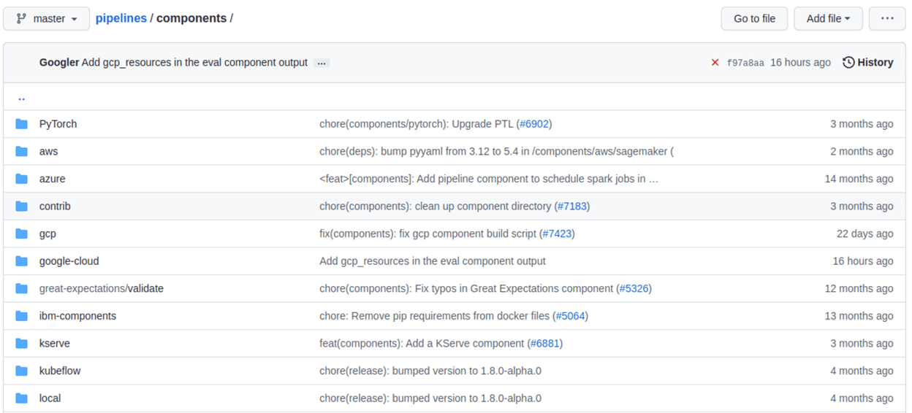

==============================================
Kubeflow Pipelines with MLFlow and Seldon Core
==============================================

Introduction
============

In this section we show you how to build your advanced machine learning operations (MLOps) pipelines using Kubeflow Pipelines (KFP), MLFlow and Seldon Core and get them to work seamlessly together to deliver your machine learning (ML) model to production in a scalable, efficient manner.

You use a wine dataset in the example. You predict the wine’s quality based on a chemical analysis. The higher the quality score is, the better the wine tastes.

Get started
===========

Set up your environment
-----------------------

Grab the `code samples <https://github.com/Barteus/kubeflow-examples/tree/0.2/e2e-wine-kfp-mlflow>`__ and execute them together in order to get the most out of the example. You need a working Freestone Kubeflow deployment with MLFLow up and running.

Going through the pipeline, each step shows you something new.

Add privilege to access MinIO for MLFlow
----------------------------------------

Check if pod-defaults is in the user's namespace.

.. code-block:: shell

   kubectl get poddefault -n admin

If there is no pod-defaults in the user's namespace, run the following command to create pod-defaults in the user’s namespace to access MinIO.

.. code-block:: shell

   USER_NAMESPACE=admin

   #MLflow
   cat <<EOF | kubectl create -n $USER_NAMESPACE -f -
   apiVersion: kubeflow.org/v1alpha1
   kind: PodDefault
   metadata:
   name: mlflow-server-minio
   spec:
   desc: Allow access to MLFlow
   env:
   - name: MLFLOW_S3_ENDPOINT_URL
      value: http://minio.kubeflow:9000
   - name: MLFLOW_TRACKING_URI
      value: http://mlflow-server.kubeflow.svc.cluster.local:5000
   selector:
      matchLabels:
         mlflow-server-minio: "true"
   EOF

   cat <<EOF | kubectl create -n $USER_NAMESPACE -f -
   apiVersion: kubeflow.org/v1alpha1
   kind: PodDefault
   metadata:
   name: access-minio
   spec:
   desc: Allow access to Minio
   selector:
      matchLabels:
      access-minio: "true"
   env:
      - name: AWS_ACCESS_KEY_ID
      valueFrom:
         secretKeyRef:
            name: mlpipeline-minio-artifact
            key: accesskey  # fill minio access key about yourself env.
            optional: false
      - name: AWS_SECRET_ACCESS_KEY
      valueFrom:
         secretKeyRef:
            name: mlpipeline-minio-artifact
            key: secretkey  # fill minio access secret key about yourself env.
            optional: false
      - name: MINIO_ENDPOINT_URL
      value: http://minio.kubeflow:9000 # update yourself env's minio url.
   EOF

   kubectl get secret mlflow-server-seldon-init-container-s3-credentials --namespace=kubeflow -o yaml \
   | sed "s/namespace: kubeflow/namespace: $USER_NAMESPACE/" \
   | sed 's/name: mlflow-server-seldon-init-container-s3-credentials/name: seldon-init-container-secret/g' \
   | kubectl apply -n $USER_NAMESPACE-f -

Download data
-------------

The first step is to download the source data and put it in object storage. 

Whenever you need to add a step to the pipeline, first check if it already exists in the `Kubeflow Pipeline components registry <https://github.com/kubeflow/pipelines/tree/master/components>`_. 

This way adding a new step to the pipeline is simple – you can either load it from the URL or download and upload it from a local file.

.. code-block:: python

   web_downloader_op = kfp.components.load_component_from_url('https://raw.githubusercontent.com/kubeflow/pipelines/master/components/contrib/web/Download/component.yaml')

Just like that, you developed your first step!

Preprocess our ML source data
-----------------------------

For the preprocessing step you need a different approach. Each data preprocessing step is different, so it's unlikely to find what you need in the KFP components registry. During the experiment phase, preprocessing is usually done in a Jupyter notebook. So wrap the code into a Python function so that you convert it into a component. It’s important to notice that ``pandas import`` is inside the Python function because the package needs to be imported inside the Docker container that eventually runns the step.

.. code-block:: python

   from kfp.components import InputPath, OutputPath

   def preprocess(file_path: InputPath('CSV'), output_file: OutputPath('parquet')):
      import pandas as pd
      df = pd.read_csv(file_path, header=0, sep=";")
      df.columns = [c.lower().replace(' ', '_') for c in df.columns]
      df.to_parquet(output_file)

You have a function write tests for it to make sure it works correctly. Now you wrap it into the container so the Kubernetes platform underneath Freestone Kubeflow knows how to invoke your code. You use the Docker image for Python 3.9 and install additional Python packages using Python’s ``pip`` package installer.

.. code-block:: python

   preprocess_op = kfp.components.create_component_from_func(
      func=preprocess,
      base_image='python:3.9',
      packages_to_install=['pandas', 'pyarrow'])

This method allows you to quickly build a pipeline in a way that does not require additional resources like template files. It also works nicely to build the pipeline using a notebook. However installing Python packages each time the step is executed is not ideal, especially if the pipeline is invoked frequently.

Train your ML prediction model
------------------------------

This preprocessing step is created using a function-based component too. The difference in this step is that you need to make calls to MLFlow and MinIO – and these calls require setting environment variables. How to securely handle setting up the environment variables is discussed later. Additionally, you change the training code, so that all of the information about the experiment is saved in MLFLow and the ML model artifacts this step generates is stored in MinIO.

.. code-block:: python

   from kfp.components import InputPath

   def train(file_path: InputPath('parquet')) -> str:
      import pandas as pd
      from sklearn.model_selection import train_test_split
      import mlflow
      from sklearn.linear_model import ElasticNet

      df = pd.read_parquet(file_path)
      target_column = 'quality'
      train_x, test_x, train_y, test_y = train_test_split(
         df.drop(columns=[target_column]),
         df[target_column])

      with mlflow.start_run(run_name='wine_models'):
         lr = ElasticNet(alpha=0.5, l1_ratio=0.5, random_state=42)
         lr.fit(train_x, train_y)
         result = mlflow.sklearn.log_model(lr, "model")
         return f"{mlflow.get_artifact_uri()}/{result.artifact_path}"

The value returned from the step is the model URI – the path to the model file in MinIO. But if you need to return more than a single value, you can use a NamedTuple. For more details, take a look at `Building Python function-based components <https://www.kubeflow.org/docs/components/pipelines/sdk/python-function-components/#building-python-function-based-components>`__.

.. code-block:: python

   training_op = kfp.components.create_component_from_func(
      func=train,
      base_image='python:3.9',
      packages_to_install=['pandas', 'pyarrow', 'sklearn', 'mlflow', 'boto3'])

The training container is created based on the same Python 3.9 Docker image as used in the previous step. When creating steps from functions, it’s best to try and use the same image whenever possible, in order to take full advantage of the Kubernetes caching mechanism for Docker images.

Deploy your ML model
^^^^^^^^^^^^^^^^^^^^

You deploy the inference server that hosts your ML model using a Docker container-based, microservices approach. The code for this step is not in the experiment notebook. You use Seldon Core for deployment together with MLFLow Server so that you take full advantage of features like monitoring your deployment without building a dedicated Docker image. The model artifacts are downloaded by the Seldon Core deployment from your MinIO object storage. In this step, you use kubectl to apply your ``SeldonDeployment`` configuration. The URI containing the path to the ML model is provided to the training step externally.

The deployment step is split into a few parts:

* create the command-line application
* wrap it in the Docker image and publish it
* create the component configuration
* create the step from the component configuration file

Create the command-line application
^^^^^^^^^^^^^^^^^^^^^^^^^^^^^^^^^^^

Firstly, create a command-line application, which calls ``kubectl`` with a file generated from a Jinja template as a parameter:

.. code-block:: python

   import argparse
   import subprocess
   from jinja2 import Environment, FileSystemLoader

   def deploy(model_uri: str):
      with open("/tmp/manifest.yaml", "w") as f:
         env = Environment(loader=FileSystemLoader('./templates'),
         trim_blocks=True, lstrip_blocks=True)
         template = env.get_template('deploy-manifest.j2')
         f.write(template.render(model_uri=model_uri))
      result = subprocess.call(['kubectl', 'apply', '-f', '/tmp/manifest.yaml', '-n', 'admin'])
      assert result == 0

   if __name__ == '__main__':
      parser = argparse.ArgumentParser(description='Data processor')
      parser.add_argument('--model_uri', help='Model URI')
      args = parser.parse_args()
      deploy(args.model_uri)

Build and push the Docker image
^^^^^^^^^^^^^^^^^^^^^^^^^^^^^^^

Next, use Docker to build and push an image to the Docker image registry. The `Dockerfile <https://github.com/Barteus/kubeflow-examples/tree/0.2/e2e-wine-kfp-mlflow/components/deploy>`_, and the build script are as below:

.. code-block:: dockerfile

   # building script
   VERSION=<version>
   REPO=<repository>
   docker build . -t $REPO:$VERSION
   docker push $REPO:$VERSION
   docker inspect --format="{{index .RepoDigests 0}}" "$REPO:$VERSION"

Create a component configuration file
^^^^^^^^^^^^^^^^^^^^^^^^^^^^^^^^^^^^^

Thirdly, create a Freestone Kubeflow pipeline step configuration file using the output from ``docker inspect``. This configuration file is crucial to share your Kubeflow pipeline step with others.

.. code-block:: shell

   name: Deploy model
   description: deploy model using seldon core
   inputs:
     - { name: model_uri, type: String, description: 'model URI' }
     implementation:
        container:
           image: <image-name>
           command: [
               python3,
               src/deploy.py,
               --model_uri,
               { inputValue: model_uri }
           ]

Load your component
^^^^^^^^^^^^^^^^^^^

Finally, load the components in a similar way to the *Download data* step. You use the configuration file created in the third step to specify which Docker image to use, how it is invoked and what the input and output parameters are.

.. code-block:: python

   deploy_op = kfp.components.load_component_from_file(
      os.path.join('components', 'deploy', 'component.yaml'))

The biggest advantage of this component creation method is extensibility. You may use any language to create the command-line application implementation as you want. You use Python and Jinja (a free templating engine) in order to keep the code clean. You have your manifest code in the template file, which is not possible with a function-based approach. Additionally, you do not need to install Python packages every time you execute the step. That means faster executions.

Feel free to use the Docker image set up and pushed into Docker image repository.

Put the MLOps pipeline together
-------------------------------

You’ve defined all the components – now let’s create a pipeline from them. You need to put them in proper order, define inputs and outputs and add appropriate configuration values.

.. code-block:: python

   @dsl.pipeline(
   name="e2e_wine_pipeline",
   description="WINE pipeline")
   def wine_pipeline(url):
      web_downloader_task = web_downloader_op(url=url)
      preprocess_task = preprocess_op(file=web_downloader_task.outputs['data'])
      train_task = (training_op(file=preprocess_task.outputs['output'])
            .add_env_variable(V1EnvVar(name='MLFLOW_TRACKING_URI', value='http://mlflow-server.kubeflow.svc.cluster.local:5000'))
            .add_env_variable(V1EnvVar(name='MLFLOW_S3_ENDPOINT_URL', value='http://minio.kubeflow.svc.cluster.local:9000'))
            .add_env_variable(V1EnvVar (name='accesskey', value='AWS_ACCESS_KEY_ID'))
            .add_env_variable(V1EnvVar (name='secretkey', value='AWS_SECRET_ACCESS_KEY'))
      )
      deploy_task = deploy_op(model_uri=train_task.output)

You don’t need to specify the order of the steps explicitly. When you set input-output dependencies, the steps will order themselves. Convenient, right?!

When looking at the training step, it differs from the others. It requires additional configuration. You need to add some sensitive data using Kubernetes secrets and the rest using environment variables. Kubeflow Pipelines supports multiple ways to add secrets to the pipeline steps and for `more information <https://kubeflow-pipelines.readthedocs.io/en/stable/source/kfp.extensions.html#module-kfp.aws>`_.

Now, the coding part is completed. All that’s left is to see the results of your pipeline. Run ``pipeline.py`` to generate ``wine-pipeline.yaml`` in the generated folder. You then open the Freestone Kubeflow Dashboard with your browser, create a new pipeline with your YAML file and – the moment of truth – run the pipeline.

.. image:: ../_static/user-guide-kfp-mlflow-seldon-result.png
    :align: center
    :scale: 60%

Check the Inference endpoint
----------------------------

To be 100% sure it works – check if the inference endpoint is responding correctly. First, go to the Kubernetes cluster and port-forward or expose the newly created service. 

.. code-block:: shell

   # check pod's status
   $ kubectl get po -n admin
   NAME                                                           READY   STATUS      RESTARTS      AGE
   ml-pipeline-ui-artifact-5cfb68f5b7-97kjc                       2/2     Running     4 (47h ago)   2d
   ml-pipeline-visualizationserver-665bb6b8fc-f5nkm               2/2     Running     4 (47h ago)   2d
   e2e-wine-pipeline-nk6qh-1447540704                             0/2     Completed   0             22h
   e2e-wine-pipeline-nk6qh-2458232327                             0/2     Completed   0             22h
   e2e-wine-pipeline-nk6qh-2359496741                             0/2     Completed   0             22h
   e2e-wine-pipeline-nk6qh-105037618                              0/2     Completed   0             22h
   mlflow-wine-super-model-0-classifier-5c79775bb6-bv9dn          3/3     Running     0             22h

   # check service's status
   $ kubectl get svc -n admin
   NAME                                                       TYPE        CLUSTER-IP       EXTERNAL-IP   PORT(S)             AGE
   ml-pipeline-visualizationserver                            ClusterIP   10.152.183.97    <none>        8888/TCP            2d
   ml-pipeline-ui-artifact                                    ClusterIP   10.152.183.103   <none>        80/TCP              2d
   mlflow-wine-super-model-classifier                         ClusterIP   10.152.183.245   <none>        9000/TCP,9500/TCP   22h
   mlflow-wine-super-model                                    ClusterIP   10.152.183.236   <none>        8000/TCP,5001/TCP   22h

   # port-forward or expose the newly created service to localhost
   $ kubectl port-forward service/mlflow-wine-super-model -n admin 8000:8000
   Forwarding from 127.0.0.1:8000 -> 8000
   Forwarding from [::1]:8000 -> 8000

Then, use ``curl`` in another terminal to see if the endpoint is responding correctly.

.. code-block:: shell

   curl -X POST http://127.0.0.1:8000/api/v1.0/predictions -H 'Content-Type: application/json' -d '{"data":{"ndarray":[[5.6, 0.31, 0.37, 1.4, 0.074, 12.0, 96.0, 0.9954, 3.32, 0.58, 9.2]]}}'

Seldon Core supports batch inference out-of-the-box and its performance is much better than calling the endpoint in a loop.

Troubleshooting
===============

Can not resolve hostname for download data URL
----------------------------------------------

Sometimes hostname is combined with a domain name, which cannot be resolved. The domain name information on this machine can be viewed in this file ``/etc/resolv.conf``.

To solved this, just add *.* after domain name to prevent CoreDNS from using fully qualified domain names (FQDN) as hostnames, such as ``raw.githubusercontent.com.``

ML Model file is not compatible with ``seldonio/mlflowserver:1.14.0-dev``
-------------------------------------------------------------------------

ML Model file saved with ``mlflow=2`` in ``mlflowserver`` is not compatible with ``seldonio/mlflowserver:1.14.0-dev``. The error shows 
``conda_env_create.py TypeError: join()`` argument must be ``str`` or ``bytes``, not ``dict``. And this issue has been `fixed <https://github.com/SeldonIO/seldon-core/pull/4505>`_. But there is no update to ``conda_env_create.py`` code for ``seldonio/mlflowserver:1.14.0-dev`` Docker image.

Choose one of the following solutions to solve this error.

- Solution 1: Update the latest `conda_env_create.py <https://github.com/SeldonIO/seldon-core/blob/master/servers/mlflowserver/mlflowserver/conda_env_create.py>`_ into ``seldonio/mlflowserver:1.14.0-dev`` Docker image and commit the new Docker image to use.

- Solution 2: Modify ``MLModel`` file

  .. code-block:: shell

     # MLModel saved with mlflow=1
     artifact_path: model
     flavors:
     python_function:
        env: conda.yaml
        loader_module: mlflow.sklearn
        model_path: model.pkl
        predict_fn: predict
        python_version: 3.9.16
     sklearn:
        code: null
        pickled_model: model.pkl
        serialization_format: cloudpickle
        sklearn_version: 1.2.1
     mlflow_version: 2.1.1
     model_uuid: 9971f5db741348cda16bfb3fc4cfff18
     run_id: 4a02ebc811b84e1194b452b38c2d96d8
     utc_time_created: '2023-02-01 08:13:32.310337'
