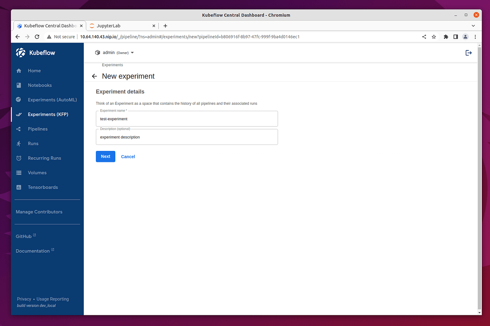
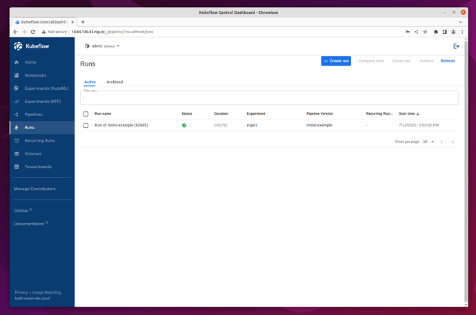
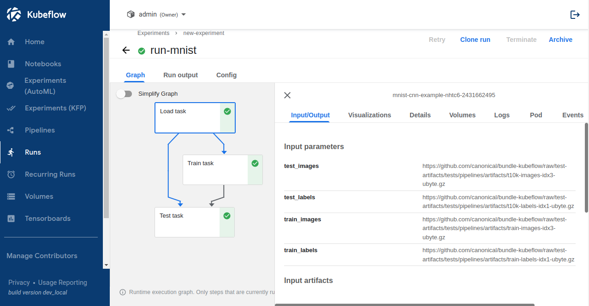

.. _kubeflow_pipelines:

============
ML Pipelines
============

.. toctree::
   :hidden:

   kfp-mlflow-seldon
   kfp-mlflow-katib

------------
Introduction
------------

The official Kubeflow Documentation explains the recommended workflow for creating a pipeline. It is well worth reading 
and helps you understand how pipelines are constructed. In this section, we take a shortcut and use one of the 
`Kubeflow testing pipelines <https://github.com/canonical/bundle-kubeflow/blob/master/tests/pipelines/mnist.py>`__.

-------------
Prerequisites
-------------

Before getting started, make sure below requirements are fulfilled:

- Have `Python3 <https://www.python.org/downloads/>`__ installed
- Have the proper ``pip`` `package installer for Python <https://pypi.org/project/pip/>`__ installed

-----------
Get Started
-----------

^^^^^^^^^^^^^^^^^^^^^^^^^
Install pipeline compiler
^^^^^^^^^^^^^^^^^^^^^^^^^

First, use ``pip`` to install ``kfp``, the `Kubeflow Pipelines SDK <https://pypi.org/project/kfp/>`_:

.. code-block:: shell
   
    pip3 install kfp

.. Note::
    Depending on your operating system, you may need to use ``pip`` instead of ``pip3`` here. Just make sure the package is installed for Python3.

^^^^^^^^^^^^^^^^^^^^^^
Get a pipeline example
^^^^^^^^^^^^^^^^^^^^^^

Next, fetch the Kubeflow repository:

.. code-block:: shell

    git clone https://github.com/canonical/bundle-kubeflow.git

The example pipelines are Python files, but to be used through the dashboard, they need to be compiled into a YAML file. The 
``dsl-compile`` command can be used for this usually, but for code which is part of a larger package, this is not always straightforward. 
A more reliable way to compile such files is to execute them as a Python module in interactive mode, and then use the ``kfp`` tool 
to compile the file.

^^^^^^^^^^^^^^^^
Compile pipeline
^^^^^^^^^^^^^^^^

Change to the right directory:

.. code-block:: shell

    cd bundle-kubeflow/tests

Then, execute the ``pipelines/mnist.py`` file as a module:

.. code-block:: shell

    python3 -i -m pipelines.mnist

Now in terminal in interactive mode, import the ``kfp`` module:

.. code-block:: python

    import kfp

Execute below function to compile the YAML file:

.. code-block:: python

    kfp.compiler.Compiler().compile(mnist_pipeline, 'mnist.yaml')

In this case, ``mnist_pipeline`` is the name of the main pipeline function in the code, and ``mnist.yaml`` is the file to be generated to define the pipeine.

^^^^^^^^^^^^^^^^^^^^^^^^^
Add the compiled pipeline
^^^^^^^^^^^^^^^^^^^^^^^^^

Once you have the compiled YAML file, download it. In Freestone Kubeflow web UI, go to pipelines dashaborad by clicking the **Pipelines** on the left-side navigation. And then click the **+ Upload pipeline** button.

In the upload page, choose **Upload a file**, and upload the ``mnist.yaml`` file. Then, click the **Create** button.

.. image:: ../_static/kfp-1.png

Once the pipeline is created, you are redirected to the pipelines Dashboard. Before running the pipeline, create an experiment first:

^^^^^^^^^^^^^^^^^^^^
Execute the pipeline
^^^^^^^^^^^^^^^^^^^^

Once the experiment is created for your pipeline, you are redirected to **Start a Run** page. For this test, select **One-off** run and 
leave all the default parameters and options unchanged. Then, click **Start** to create your first Pipeline run.

.. image:: ../_static/kfp-3.png

^^^^^^^^^^^^
View results
^^^^^^^^^^^^

Once the run is started, you are redirected to **Runs** page, showing details of all the steps of the pipeline run. After a few minutes, 
there is a green checkpoint showing that it has been executed successfully.

In order to see more details, you click on the pipeline run and you are navigated to a page which shows all steps of the 
pipeline that have been executed. Click on each step of the pipeline, a new window will pop up on the right side, showing you the 
detailed information of the corresponding pipeline step, such as its pod, logs, YAML, etc.

^^^^^^^^^^^^^^^
Delete pipeline
^^^^^^^^^^^^^^^

To delete the pipeline, select it by checking the tick box on the left side of the pipeline name. Go to the top right corner, and click "Delete".

A new window pops up and asks you to confirm the pipeline deletion.

.. image:: ../_static/kfp-6.png

That’s it, your pipeline is now deleted!
