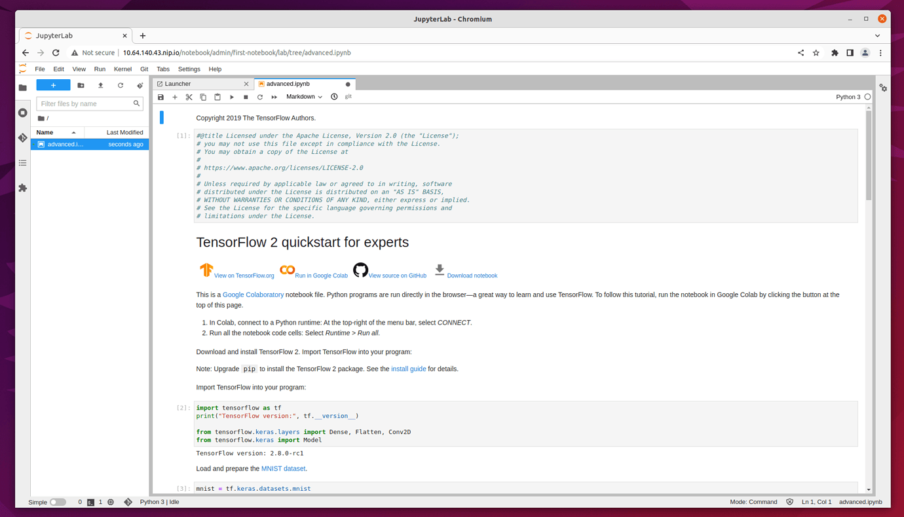
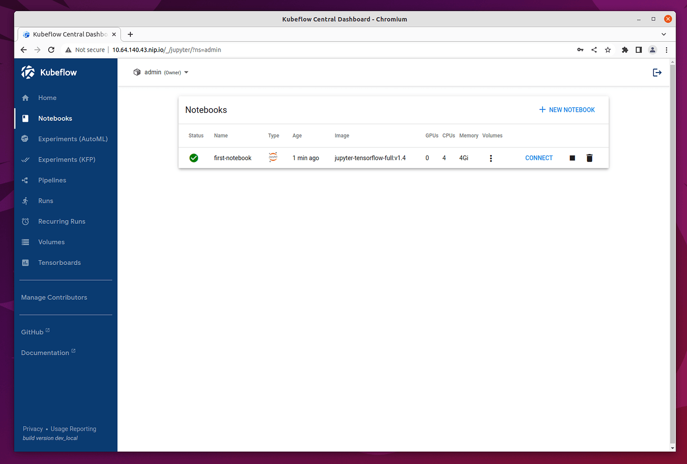

.. _user-guide-notebooks:

=========
Notebooks
=========

Introduction
------------

Freestone Kubeflow Notebooks provide a way to run web-based development environments, Jupyter Notebooks inside your Kubernetes cluster by running them inside Pods.

Jupyter Notebook is an interactive web-based computational environment that allows you to create and share notebook files that contain live code, equations, visualizations, and narrative text. It supports many programming languages, including Python, R, and Julia, among others.

Jupyter Notebook is particularly popular among data scientists, researchers, and educators because of its ability to combine code with rich text, making it easy to communicate ideas, results, and analyses with others. It also allows you to run code in small, testable chunks, making it easy to experiment and debug code.

Get Started
-----------

Create a Freestone Kubeflow Notebook
^^^^^^^^^^^^^^^^^^^^^^^^^^^^^^^^^^^^^^^^^^^^^

The dashboard gives you an overview of the Notebook Servers currently available on your Freestone Kubeflow installation. In a freshly installed Freestone Kubeflow there is no Notebook Server.
You will create a new Notebook Server by clicking on **Notebooks** in the left-side navigation and then clicking on the **+ New Notebook** link in blue at the top right corner.

In the **New Notebook** page, you are able to specify several options for the notebook you are creating. First, give it a name in the **Name** field. In the **image** dropdown list, choose an image with ``jupyter-tensorflow-full`` in the name. It is required for your example notebook. (More details about container images used for Notebook Servers are introduced later.) Please leave the CPU and memory requirements to the default values.

Once the Notebook Server is created, you connect to it by clicking on the **CONNECT** link in blue on the right side and access your Jupyter Notebook environment which is opened in a new tab.

.. image:: ../_static/notebook-1.png

Use the `Tensorflow 2 quickstart for experts example <https://www.tensorflow.org/tutorials/quickstart/advanced>`_ to test the server.

Click on the above link and click on the **Download Notebook** button just below the heading. It downloads the file ``advanced.ipynb`` into your usual download location. This file is used to create the example notebook.

On the **Notebook Server** page, click on the Upload Files (up arrow) button, which is located in the side-bar at the top, and select the file ``advanced.ipnyb``.

.. image:: ../_static/notebook-2.png

Once uploaded, click on the notebook name to open a new tab with the notebook content.

You may read through the content for a better understanding of what this notebook does. Click on the Run button **▶︎** to execute each cell of the notebook, or click on the double-right arrows **>>** to execute the entire notebook.

Freestone Kubeflow Notebook Volumes
^^^^^^^^^^^^^^^^^^^^^^^^^^^^^^^^^^^^^^^^^^^^

In order to see the volumes of the notebook that you just created, click on the three dots button in **Volumes** column of the notebook chosen. You see a volume with name ``dshm`` and another one with the same name as the notebook plus suffix ``-volume``.

.. image:: ../_static/notebook-4.png

Delete a Freestone Kubeflow Notebook
^^^^^^^^^^^^^^^^^^^^^^^^^^^^^^^^^^^^^^^^^^^^^

To delete a notebook, you first click on **Notebooks** in the left-side navigation. Then，go to the notebook you want to delete, and click on the small trash bin icon along with the notebook.

A prompt box appears on your screen. Click **DELETE** in red.

.. image:: ../_static/notebook-6.png

Container Images
^^^^^^^^^^^^^^^^

Earlier, you chose an image with ``jupyter-tensorflow-full`` in name to create the Notebook Server. Now, we introduce you to container images in more details.

Freestone Kubeflow Notebooks natively supports three types of notebooks: `JupyterLab <https://github.com/jupyterlab/jupyterlab>`_, 
`RStudio <https://github.com/rstudio/rstudio>`_, and `Visual Studio Code (code-server) <https://github.com/coder/code-server>`_. But any web-based IDE 
should work. Notebook Servers run as containers inside a Kubernetes Pod, which means the Docker image you pick for your server determines the type of IDE (and which packages are installed) to use.

Provided Images
~~~~~~~~~~~~~~~

You can get started with a number of `example container images <https://github.com/kubeflow/kubeflow/tree/master/components/example-notebook-servers>`_ listed in the following table. In addition, each of the links in the table guides you to a GitHub repo in which you can find the Dockerfile of an example container image.

.. list-table::
   :widths: auto
   :header-rows: 1

   * - Dockerfile
     - Registry
     - Notes
   * - `jupyter-scipy <https://github.com/kubeflow/kubeflow/tree/master/components/example-notebook-servers/jupyter-scipy>`_
     - kubeflownotebookswg/jupyter-scipy:{TAG}
     - JupyterLab + `SciPy <https://scipy.org/>`_ packages
   * - `jupyter-pytorch-full (CPU) <https://github.com/kubeflow/kubeflow/tree/master/components/example-notebook-servers/jupyter-pytorch-full>`_
     - kubeflownotebookswg/jupyter-pytorch-full:{TAG}
     - JupyterLab + PyTorch (CPU)  `common <https://github.com/kubeflow/kubeflow/blob/master/components/example-notebook-servers/jupyter-pytorch-full/requirements.txt>`__ packages
   * - `jupyter-pytorch-full (CUDA) <https://github.com/kubeflow/kubeflow/tree/master/components/example-notebook-servers/jupyter-pytorch-full>`_
     - kubeflownotebookswg/jupyter-pytorch-cuda-full:{TAG}
     - JupyterLab + PyTorch (CUDA) + `common <https://github.com/kubeflow/kubeflow/blob/master/components/example-notebook-servers/jupyter-pytorch-full/requirements.txt>`__ packages
   * - `jupyter-tensorflow-full (CPU) <https://github.com/kubeflow/kubeflow/tree/master/components/example-notebook-servers/jupyter-tensorflow-full>`_
     - kubeflownotebookswg/jupyter-tensorflow-full:{TAG}
     - JupyterLab + TensorFlow (CPU) + `common <https://github.com/kubeflow/kubeflow/blob/master/components/example-notebook-servers/jupyter-tensorflow-full/requirements.txt>`_ packages
   * - `jupyter-tensorflow-full (CUDA) <https://github.com/kubeflow/kubeflow/tree/master/components/example-notebook-servers/jupyter-tensorflow-full>`_
     - kubeflownotebookswg/jupyter-tensorflow-cuda-full:{TAG}
     - JupyterLab + TensorFlow (CUDA) + `common <https://github.com/kubeflow/kubeflow/blob/master/components/example-notebook-servers/jupyter-tensorflow-full/requirements.txt>`_ packages
   * - `codeserver-python <https://github.com/kubeflow/kubeflow/tree/master/components/example-notebook-servers/codeserver-python>`_
     - kubeflownotebookswg/codeserver-python:{TAG}
     - code-server (Visual Studio Code) + Conda Python
   * - `rstudio-tidyverse <https://github.com/kubeflow/kubeflow/tree/master/components/example-notebook-servers/rstudio-tidyverse>`__
     - kubeflownotebookswg/rstudio-tidyverse:{TAG}
     - RStudio + `Tidyverse <https://www.tidyverse.org/>`_ packages

.. seealso::
   - `Arrikto Kubeflow Notebooks <https://docs.arrikto.com/features/notebook-images.html#>`_
   - `Kubeflow Notebooks <https://www.kubeflow.org/docs/components/notebooks/>`_
   - `Example Notebook Servers <https://github.com/kubeflow/kubeflow/tree/master/components/example-notebook-servers>`_
   - `Container Images <https://www.kubeflow.org/docs/components/notebooks/container-images/>`_
