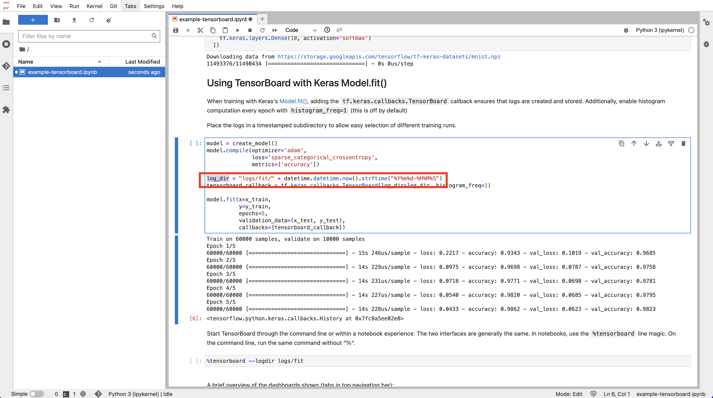
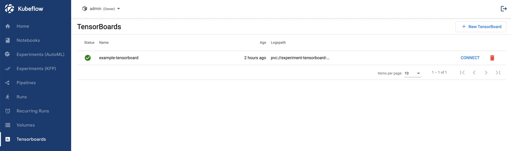

=============================
Visualization for Experiments
=============================

------------
Introduction
------------

Whether you're an expert or a beginner, TensorFlow offers an end-to-end platform that makes it easy for you to build and deploy machine learning (ML) 
models. TensorBoard provides the visualization and tooling needed for ML experimentation, such as tracking and 
visualizing loss and accuracy metrics, displaying the model graph (ops and layers), showing images, text, and playing audio data, etc.
It provides you with easy model building, robust ML prediction and powerful experimentation for research. You can learn more about 
the project on `TensorBoard: TensorFlow's visualization toolkit <https://www.tensorflow.org/tensorboard>`_.

In this section, we introduce you some basic and powerful functionalities of TensorBoard by walking you through an example.

-----------
Get started
-----------

^^^^^^^^^^^^^^^^^^^^^^^^^
Download example notebook
^^^^^^^^^^^^^^^^^^^^^^^^^

Feel free to reuse the Notebook Server created in the previous sections. Connect to it and upload a new notebook downloaded from `TensorBoard example
<https://www.tensorflow.org/tensorboard/get_started>`_.

^^^^^^^^^^^^^^^^^
Configure and run
^^^^^^^^^^^^^^^^^

Go through the example notebook to have a better idea about what this example is working on.

.. Note::
    The ``log_dir`` path is important. It's needed for TensorBoard creation.

Run the notebook, and navigate to "Tensorboards" from left toolbar on Freestone Kubeflow Dashboard UI.

.. note:: 
    You may need to run ``pip install tensorflow`` to install TensorFlow package if you have not done so.

.. image:: ../_static/user-guide-tensorboard-toolbar.png

Click on "New Tensorboard". Give it a name and tick the PVC checkbox. Select your notebook’s workspace volume from the dropdown list and 
fill in the ``Mount Path`` field with the ``log_dir`` you have noted in the previous step. In this example, it’s ``logs/fit``.

.. image:: ../_static/user-guide-tensorboard-new.png

That’s it! Click on "CREATE" and your TensorBoard is up and running within minutes.

You then connect to it and see various metrics and graphs.

.. image:: ../_static/user-guide-tensorboard-graph.png
