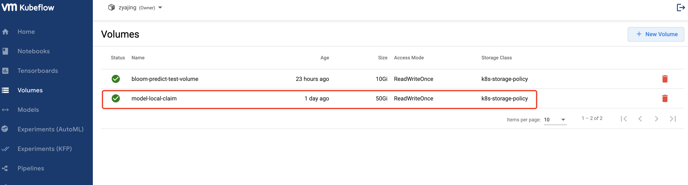

# BLOOM Deployment on vSphere Machine Learning Extension with Kubeflow KServe

The InferenceService custom resource is the primary interface that is used for deploying models on KServe. Inside an InferenceService, users can specify multiple components that are used for handling inference requests. These components are the predictor, transformer, and explainer. For more detailed documentation on Kubeflow KServe, refer to [KServe](https://kserve.github.io/website/0.7/modelserving/data_plane/).

This tutorial show you how to run BLOOM model inference, and more detailed information can be see in the [bloom_kserve.ipynb](https://github.com/vmware/vSphere-machine-learning-extension/blob/main/examples/llm_bloom_deployment/kserve/bloom_kserve.ipynb)

The BLOOM model size this turorial for Kserve uses is 560m. File size of the whole model MAR package is about 3GB. 4G GPU is only required for this deployment.

## Setup

### Prerequisite

- The vSphere Machine Learning Extension platform is ready for use.

- The BLOOM 560m MAR model has been prepared and ready for use.

  Please refer to `Prepare MAR model package and it's config` section on the [llm_bloom_deployment/README.md](../README.md) to prepare the model MAR file.

### 1. Create PVC and Mount the Model.

#### 1.1 Create a volume in vSphere Machine Learning Extension UI

Use your web browser to login to vSphere Machine Learning Extension, and click volumes, then click the New volume in the top right bar to create pvc.




#### 1.2 Create pv pod to mount the model

Create pod to mount the model.

```
cat << EOF | kubectl create -n <your_namepsace> -f -
apiVersion: v1
kind: Pod
metadata:
  name: model-store-pod
spec:
  volumes:
    - name: pv-storage
      persistentVolumeClaim:
        claimName: model-local-claim
  containers:
    - name: pv-container
      image: ubuntu
      command: [ "sleep" ]
      args: [ "infinity" ]
      volumeMounts:
        - mountPath: "/pv"
          name: pv-storage
      resources:
        limits:
          memory: "4Gi"
          cpu: "2"
EOF
```

Copy the model MAR file and config.properties to PVC in the below structure.
**Note**  MAR model file and config.properties follow the below structure:
```
|_model-store
  |_bloom-560m.mar
|_config
  |_config.properties
```

Also config.properties is sightly different before.

```
cat ./kserve/config/config.properties
inference_address=http://0.0.0.0:8085
management_address=http://0.0.0.0:8085
metrics_address=http://0.0.0.0:8082
grpc_inference_port=7070
grpc_management_port=7071
enable_metrics_api=true
metrics_format=prometheus
number_of_netty_threads=4
job_queue_size=10
enable_envvars_config=true
install_py_dep_per_model=true
model_store=/mnt/models/model-store
model_snapshot={"name":"startup.cfg","modelCount":1,"models":{"bloom":{"1.0":{"defaultVersion":true,"marName":"bloom.mar","minWorkers":1,"maxWorkers":5,"batchSize":1,"maxBatchDelay":5000,"responseTimeout":120}}}}
```

```
kubectl exec -it model-store-pod -n <your_namepsace> -- cd pv/ && mkdir model-store
kubectl exec -it model-store-pod -n <your_namepsace> -- cd pv/ && mkdir config

kubectl cp bloom.mar model-store-pod:/pv/model-store/ -n <your_namepsace>
kubectl cp config.properties model-store-pod:/pv/config/ -n <your_namepsace>
```


### 2. Create the InferenceService

**Notice**: Remember to delete model-store-pod pod to unmount pvc, Or if you create inferenceservice YAML file, will got model-local-claim pvc have been used.

Apply the CRD

```
cat << EOF | kubectl create -n <your_namepsace> -f -
apiVersion: serving.kserve.io/v1beta1
kind: InferenceService
metadata:
  name: "torchserve-bloom-560mm"
spec:
  predictor:
    pytorch:
      storageUri: pvc://model-local-claim
      resources:
          limits:
            cpu: 8
            memory: 16Gi
            nvidia.com/gpu: 1
EOF
```

### 3. Test Perform Inference

#### 3.1 Determine host and session

Run the following command to get host, which will be set to the headers in our request in the terminal.

```
kubectl get inferenceservice torchserve-bloom-560m -n <your_namepsace> -o jsonpath='{.status.url}' | cut -d "/" -f 3
```

#### 3.2 Test model prediction

Use your web browser to login to vSphere Machine Learning Extension, and get Cookies: authservice_session (Chrome: Developer Tools -> Applications -> Cookies)

```
export SESSION='<your_authservice_session>'
```

```
export SERVICE_HOSTNAME='<your_service_hostname>'
export MODEL_NAME='<your_model_name>'
```

The first step is to [determine the ingress IP and ports](https://kserve.github.io/website/0.10/get_started/first_isvc/#4-determine-the-ingress-ip-and-ports) and set ``INGRESS_HOST`` and ``INGRESS_PORT``

```
export INGRESS_HOST='<your_ingress_host>'
export INGRESS_PORT='<your_ingress_port>'
```

```
cd examples/llm_bloom_deployment/kserve

curl -v -H "Host: $SERVICE_HOSTNAME" -H "Host: ${SERVICE_HOSTNAME}" http://${INGRESS_HOST}:${INGRESS_PORT}/v1/models/${MODEL_NAME}:predict -d @./sample_text4.json
```

Expected Output

```
*   Trying 10.105.150.44:80...
* TCP_NODELAY set
* Connected to 10.105.150.44 (10.105.150.44) port 80 (#0)
> POST /v1/models/bloom:predict HTTP/1.1
> Host: torchserve-bloom-560m.zyajing.example.com
> User-Agent: curl/7.68.0
> Accept: */*
> Cookie: authservice_session=MTY4MzUxMzI0MHxOd3dBTkVvMVdFOUZRVWxaU0ZSQ1MwVlZObE5hTXpkUU4xaEJUMGxPUVZOU1ZFdFBSVkUyUlRSTk5sSkpWRkpKUkRJeVZVUTJRMUU9fLH0CcadTC6658xbIccfZBXOeqIngfq7fPEbQf3e4fO1
> Content-Length: 61
> Content-Type: application/x-www-form-urlencoded
>
* upload completely sent off: 61 out of 61 bytes
* Mark bundle as not supporting multiuse
< HTTP/1.1 200 OK
< content-length: 309
< content-type: application/json; charset=UTF-8
< date: Mon, 08 May 2023 05:58:04 GMT
< server: envoy
< x-envoy-upstream-service-time: 2557
<
* Connection #0 to host 10.105.150.44 left intact
{"predictions": ["My dog is cute and cuddly.\nShe's cute, too. I love her! Oh, no, no, it isn't you, it's me.\nOkay, so I'm in a bit of a weird situation.\nYeah, just...\nI'm a little unsettled.\nNot quite.\nWe went on a date.\nWhy don't we just take a day?\nCome on.\nSo we can go out together.\nAnd then,"]}
```

#### 3.3 Delete InferenceService

When you are done with your InferenceService, you can delete it by running the following.

```
kubectl delete inferenceservice <your_inferenceservice>  -n <your_namepsace>
```
