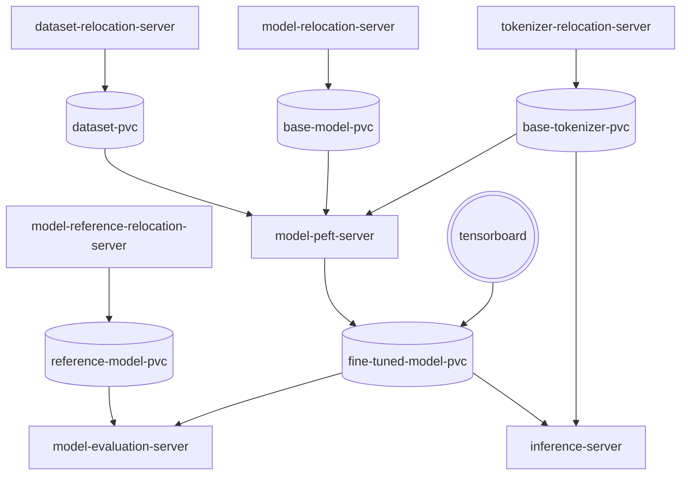

# Private Fine-Tuning

Privately fine-tune a LLM using Parameter Efficient Fine-Tuning with private data.



## [Pushing components to registries](docs/registries.md)

## Updating the models

Updating the base and reference models from GPT2 is a matter of updarting the files and the occurrences of `gpt2` in the code.

> Because we are storing the full model, we need to track the large files using `git lfs` before pushing to a different GitHub repository:  

```bash
git lfs track components/model-reference-relocation-server/models/gpt2-large/pytorch_model.bin
git lfs track components/model-relocation-server/models/gpt2/pytorch_model.bin
```


## Local development with KinD

Single node required:

```bash
kind create cluster
```

### Installing

With skaffold everything can be built and run with one command for local iteration, the first time will take a while
because all the images are being created.

```bash
skaffold run --port-forward=true
```

> Note that the evaluation server takes over 80 minutes.
But since the inference server is created in parallel, we can use it while evaluation happens.


After running the `skaffold` command, it should display something like:
```bash
Waiting for deployments to stabilize...
 - deployment/model-inference-server is ready.
Deployments stabilized in 4.135 seconds
Port forwarding service/model-inference-service in namespace default, remote port 5000 -> http://127.0.0.1:5002
```

And the inference server is ready to receive requests:
```bash
 curl -XPOST 127.0.0.1:5002/prompt -d '{"input_prompt":"What is the best hotel in Seville?"}' -H 'Content-Type: application/json'
```

## Using KubeFlow

KubeFlow automates all the creation of Kubernetes objects, their synchronization and adds utilities to help us with experiments and visualization.

### Building the pipeline

[Using the notebook](kubeflow/GeneratePipeline.ipynb) or running [pipeline.py](kubeflow/pipeline.py)

### Visualising data in TensorBoard

Select the PVC from `fine-tuned-model-pvc`.
With the following mount path: `model/gpt2/logs/`.

> Note that since some environments can't easily create Persistent Volumes with `ReadWriteMany`, we have to wait for completion or to delete the board once we analyzed it.
