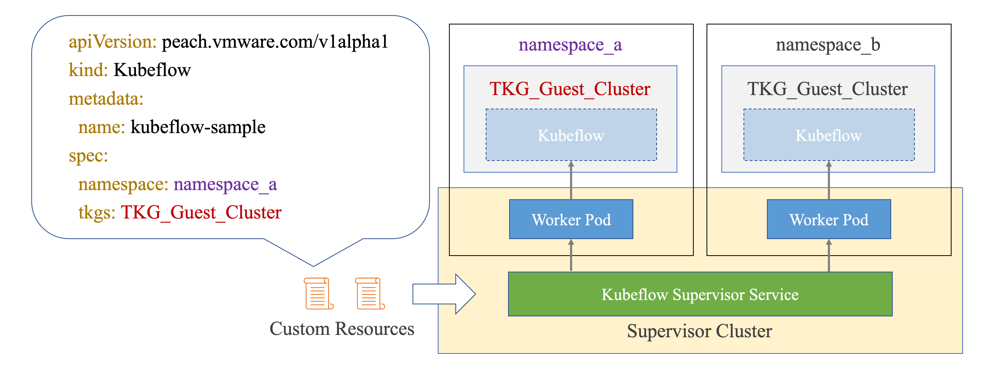

# Peach 🍑 kubeflow-supervisor-service



## User Guide

https://vmware.github.io/ml-ops-platform-for-vsphere/docs/deployment/supervisor_service/

## Build Supervisor Service Manifest
Generate Supervisor Service Manifest with the version you specify by running
```bash
VERSION="0.0.1" ./build.sh
```