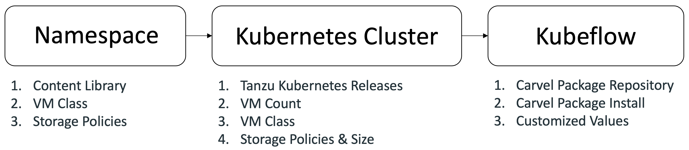

+++
title = "Getting Started"
description = "Deploy Kubeflow on vSphere"
weight = 20
+++

This tutorial will guide you through the **three** steps to get Kubeflow up and running on your vSphere platform. Please make sure you meet the [**Prerequisites**](./prerequisites) before getting started.

1. [**Create and configure a vSphere namespace**](./namespace). You will configure `Content Library`, `VM Class`, `Storage Policies` in the step.
2. [**Create a Tanzu Kubernetes Cluster**](./cluster). You will create a Tanzu Kubernetes Cluster with in the namespace you just created in the first step.
3. [**Deploy Kubeflow**](./carvel). Deploy Kubeflow 1.6 on Tanzu Kubernetes Cluster you created before, with features like `bitfusion` enabled.

