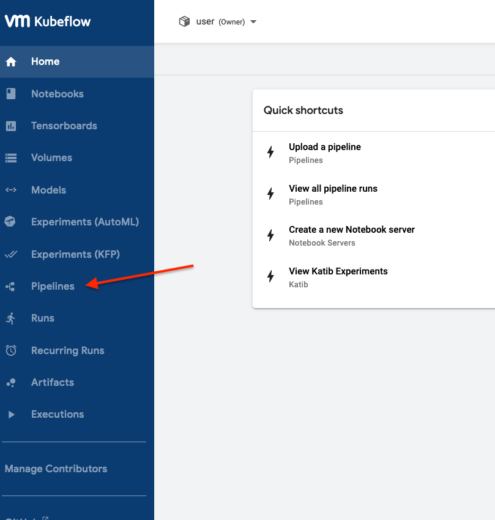
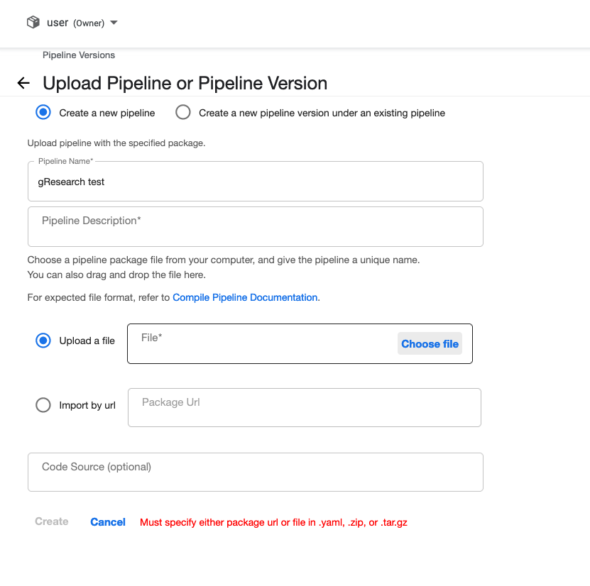
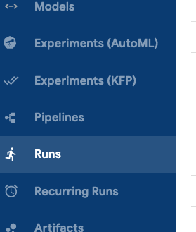

# Lab 7: Kubeflow Pipeline

## Full Source

You can view and download the complete repo from (including notebooks, datasets, source codes, Dockerfile, etc) [here](https://gitlab.eng.vmware.com/models/kubeflow-tutorial/-/tree/main/labs/lab7_pipeline).

---
## Table of Contents
- [Introduction](#introduction)
- [Understand pipeline and pipeline components](#understand-pipeline-and-pipeline-components)
- [Example overview](#example-overview)
    - [Example 1 facial keypoint detection: build pipeline from docker images](#example-1-facial-keypoint-detection)
    - [Example 2 g-research crypto forecasting: build pipeline from notebook directly](#example-2-g-research-crypto-forecasting)
- [Running a pipeline](#running-a-pipeline)
---

## Introduction
Kubeflow Pipelines is a platform for building and deploying portable, scalable machine learning (ML) workflows based on Docker containers. Each pipeline represents an ML workflow, and includes the specifications of all inputs needed to run the pipeline, as well the outputs of all components.

Kubeflow Pipelines is one of the most powerful and popular features of Kubeflow. In this lab, we would guide you through two concrete examples  to build up and run Kubeflow pipelines in two different ways.

- [Example 1 Facial Keypoint Detection: build pipeline from docker images](https://gitlab.eng.vmware.com/models/kubeflow-tutorial/-/blob/main/labs/lab7_pipeline/example1_facialKeypoint.ipynb)
- [Example 2 G-Research Crypto Forecasting: build pipeline from notebook directly](https://gitlab.eng.vmware.com/models/kubeflow-tutorial/-/blob/main/labs/lab7_pipeline/example2_gResearch.ipynb)

*For each example, we provide you with a already-compiled pipeline YAML files for quick-test purpose. If you prefer that, feel free to skip to pipeline running part and use them.*

## Understand Pipeline and Pipeline Components

A Kubeflow pipeline is a portable and scalable definition of an ML workflow, based on containers. A pipeline is composed of a set of input parameters and a list of the steps in this workflow. Each step in a pipeline is an instance of a component, which is represented as an instance of `ContainerOp`.

A pipeline component is a containerized application that performs one step in a pipeline’s workflow. Pipeline components are defined in component specifications. More details about components specifications can be found [here](https://www.kubeflow.org/docs/components/pipelines/v1/reference/component-spec/).

Each step in our pipeline’s workflow is an instance of a component. When we define our pipeline, we specify the source of each step’s inputs. Step inputs can be set from the pipeline’s input arguments, constants, or step inputs can depend on the outputs of other steps in this pipeline. Kubeflow Pipelines uses these dependencies to define our pipeline’s workflow as a graph.

## Example Overview

We suggest you go through examples in order, as some concept explanations are more detailed in Example 1.

### Example 1: Facial Keypoint Detection

*Notebook, Model source codes, datasets, Dockerfiles, example pipeline YAML file and example pipeline logs are all included in repo.*

#### About Model

This model comes from Kaggle Competition. The objective of this task is to predict keypoint positions on face images, which can be used as a building block in several applications, such as analysing facial expressions and biometrics recognition.

There are two main tasks: train and evaluation. Each would be build as a pipeline component later. 

Datasets for training can be found in [train/my_data](./train/my_data).

More details about this model itself can be found [here on Kaggle Competition page](https://www.kaggle.com/competitions/facial-keypoints-detection).

#### About Pipeline

**In this example, we would first containzernize each pipeline component as a docker image, and then build pipeline from these components' images.**

When Kubeflow Pipelines executes a component, a container image is started in a Kubernetes Pod and your component’s inputs are passed in as command-line arguments.

Therefore, while designing pipeline components, we need to consider following issues:
* Which inputs can be passed to our component by value? And which inputs, which cannot be directly passed as a command-line argument, should be passed to your component by a reference to the input’s path?
* To return an output from our component, the output’s data must be stored as a file. We need to let Kubeflow Pipelines know what outputs our component produces, so that when our pipeline runs, Kubeflow Pipelines can pass the paths that we use to store our component’s outputs as inputs to our component.
* Since your inputs and output paths are passed in as command-line arguments, your component’s code must be able to read inputs from the command line. 

And in this example, specifically, a component specification should define:
* The component’s inputs and outputs
* The container image that your component’s code runs in, the command to use to run your component’s code, and the command-line arguments to pass to your component’s code
* The component’s metadata, such as the name and description

### Example 2: G-Research Crypto Forecasting

*Notebook, example pipeline YAML file and example pipeline logs are included in repo.*

### About Model

This model comes from Kaggle Competition. Over $40 billion worth of cryptocurrencies are traded every day. The objective of this task is to correctly forecast short term returns in 14 popular cryptocurrencies. [G-Research](https://www.gresearch.co.uk/) is Europe’s leading quantitative finance research firm, and partered with [Cambridge Spark](https://www.cambridgespark.com) for this Kaggle Competition.

The dataset this model would use contains information on historic trades for several cryptoassets, such as Bitcoin and Ethereum. Dataset would be downloaded from Kaggle.

More details about this model and dataset itself or Kaggle Competition can be found [here](https://www.kaggle.com/competitions/g-research-crypto-forecasting/overview).

### About Pipeline

### Design Pipeline

**In this example, we would directly build pipeline components in notebook, from model itself. Some modifications are required to the original model function.**

Again, we design our pipeline component by component. We build our components this time as Python function-based components. The Kubeflow Pipelines SDK makes it easier to build lightweight Python function-based components by saving the effort of creating a component specification. Python function-based components make it easier to build pipeline components by building the component specification for you. Python function-based components also handle the complexity of passing inputs into your component and passing your function’s outputs back to your pipeline.

Let's walk through this concrete example to understand above ideas better.

Note that the overall workflow follows from original model itself. So please do not freak out when you see long, heavy code cells.

Basically, the following modifications were required to the original function.
- The import statements were moved inside of the function. Python function-based components require standalone Python functions. This means that any required import statements must be defined within the function, and any helper functions must be defined within the function. 
- The function’s arguments all include `data_path` which specifies the location for data storage, and also accessing. This lets Kubeflow Pipelines know the where to extract the data in zipped tar file into, where your function stores the processed data or model, and where to access it and use it as inputs for components.

## Running a Pipeline

In both examples, we compiled the pipeline as a YAML file. So here we provide you with a brief guide on how to run a pipeline.

We would use Example 2: G-Research Crypto Forecasting as example.

### Upload the pipeline to Kubeflow UI

Following our notebook, you should be able to see a file called `pipeline_gResearch.yaml`, under the same directory of the example 2 notebook. Download `pipeline_gResearch.yaml`, and upload it to Pipelines on Kubeflow UI.






This pipeline graph is more complex than the one in Example 1. You may take some time going through it. 

### Create experiment and run

Create an experiment for this pipeline, and create a run. This time, you need to provide two inputs, `dataset` and `data_path`, exactly the ones for our first step Data Download. If you do not intend to make any personalization on datasets and data path, enter following values
```python
# arguments
# "" not needed while inputting them
dataset = "g-research-crypto-forecasting"
data_path = "/mnt"
```


The pipeline would start to run then. You would be able to see the running process in Runs Page on Kubeflow UI.



The pipeline running may take some time, as the datasets is pretty big and there are much more steps in this example. There would be a green symbol appears next to each component after its completion. And you can always click on each component to see its details, such as its input/output, volumes, logs, and pod.

### Check logs and outputs


After the whole pipeline finishes running, click on any of the component/step that you are interested in. You should be able to see main-logs under Input/Output, Output artifacts. 

Specifically, click on Evaluation Result Step, you should see "metrics" under Input/Output, Output artifacts. Click into them to see the evaluation metrics.

We also provide you with example logs of evaluation metrics in [logs](https://gitlab.eng.vmware.com/models/kubeflow-tutorial/-/tree/main/labs/lab7_pipeline/logs) folder.